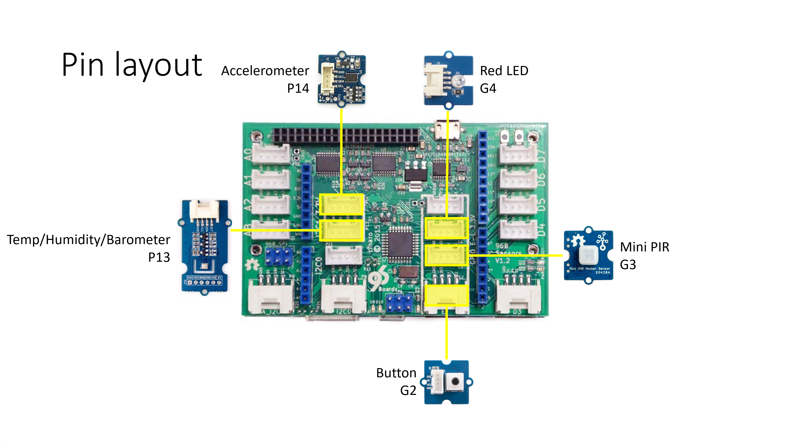

# Lab 01 - Getting started with development on Windows 10 IoT Core with Arrow Dragonboard 410c

This lab covers setting up Windows 10 IoT Core on an Arrow Dragonboard 410 and deploying apps using Visual Studio.

## Pre-requisites
### Hardware
* Arrow Dragonboard 410c
* Grove LED
* Grove Mini PIR Sensor
* 


### Software
* Visual Studio 2019 Community Edition (or above)

## 1 - Installing Windows 10 IoT Core with IoT Dashboard

Devices running Windows 10 IoT Core can be installed and configured using the IoT Dashboard. This tool makes it simple to get started and also provision Azure connectivity.

### 1.1 - Installing IoT Dashboard

1. Open a browser window to: [http://go.microsoft.com/fwlink/?LinkID=708576](http://go.microsoft.com/fwlink/?LinkID=708576)
1. Launch the IoT Dashboard and verify the application starts correctly


### 1.1 - Installing Windows 10 IoT Core

1. Connect Dragonboard to host PC with a Micro-USB cable
1. Hold down the 'Volume Up (+)' button while plugging in the power adapter into the Dragonboard
1. Open IoT Dashboard and click 'Setup a new device'
1. Change the device type to 'Qualcomm \[Dragonboard 410c\]' and set the OS Build to 'Windows 10 IoT Core (17763)'
1. Accept the license agreement and click 'Download and Install'


### 1.2 - Validating your install

1. Once the Dragonboard has completed installing, a line entry will show in the IoT Dashboard as above
2. Right click on your device and select 'Device Portal'
3. In your browser enter the default username and password:

|Name    |Value|
|--------|-----|
|Username|Administrator|
|Password|p@ssw0rd|


4. Enter a name in the 'Change your device name' text box and click 'Save'. Your device should reboot and display the new name 


## 2 - Deploying apps to Dragonboard

### 2.1 - Hello world

1. Open up the first lab project found in [C:\Labs\content\src\IoTLabs.Dragonboard\IoTLabs.Dragonboard.sln](file:///C:\Labs\content\src\IoTLabs.Dragonboard.sln) 
1. Update the target system architecture to say 'ARM' as shown in the image below


1. Change target system from 'Local' to 'Remote Machine' and enter the IP address of your device. This can be found on the screen of your device


1. Run the project to test it on your Dragonboard. You should see an interface, however no data should be showing

### 2.2 - Adding sensors

Our application uses a number of sensors to display as output on the screen. The next steps will cover connecting these sensors up. **Note:** When wiring up the sensors, specific ports are selected due to their voltage and wiring. The following diagram will be useful:



#### 2.2.1 - Red LED

1. Refer to the wiring diagram to attach the Red LED Grove module to socket G4
2. Open ```ViewModel/MainViewModel.cs``` in the Visual Studio project and paste the following lines in at line 189:
```csharp
//LED
LedSensor = GroveSensorFactory.CreateRedLedSensorService();
await LedSensor.Initialize();
LedIsHigh = LedSensor.GetState().CurrentValue == GpioPinValue.High;
``` 
3. Run the project again and test the Red LED buttons in the application

#### 2.2.2 - Barometer/Temperature/Humidity

1. Refer to the wiring diagram to attach the Barometer Grove module to socket P13
2. Open ```ViewModel/MainViewModel.cs``` in the Visual Studio project and paste the following lines in at line 194:

```csharp
//Barometer Sensor
BarometerSensor = GroveSensorFactory.CreateBarometerSensorService();
await BarometerSensor.Initialize();
((IPollingSensor<GroveBarometerSensorState>)BarometerSensor).Register(new Action<GroveBarometerSensorState>(
    (GroveBarometerSensorState item) =>
    {
        DispatcherHelper.CheckBeginInvokeOnUI(() =>
        {
            Temperature = item.TemperatureFahrenheit.ToString("##0.0") + " F";
            Humidity = item.HumidityPercent.ToString("##0.0") + "%";
            Pressure = item.PressureKilopascals.ToString("##0.0") + " kPA";
            LastBarometerUpdate = item.Timestamp.Date.ToShortDateString() + " " + item.Timestamp.Date.ToLongTimeString();
        });
    }), 250);
``` 
3. Run the project again and test the sensor values are updating in the application

#### 2.2.3 - PIR (Motion) Sensor

1. Refer to the wiring diagram to attach the Barometer Grove module to socket G3
2. Open ```ViewModel/MainViewModel.cs``` in the Visual Studio project and paste the following lines in at line 209:

```csharp
//MotionSensor
MotionSensor = GroveSensorFactory.CreateMiniPIRMotionSensorService();
await MotionSensor.Initialize();
((IObservableSensor<GroveMiniPIRMotionSensorState>)MotionSensor).Register(new Action<GroveMiniPIRMotionSensorState>(
    (GroveMiniPIRMotionSensorState item) =>
    {
        DispatcherHelper.CheckBeginInvokeOnUI(async () =>
            {
                MotionEdge = item.CurrentEdge.ToString();
                MotionPin = item.PinNumber.ToString();

                if (item.CurrentEdge == GpioPinEdge.FallingEdge)
                {
                    IsFallingEdgeMotion = true;
                    await Task.Delay(TimeSpan.FromMilliseconds(250));
                    IsFallingEdgeMotion = false;
                }
                else
                {
                    IsRisingEdgeMotion = true;
                    await Task.Delay(TimeSpan.FromMilliseconds(250));
                    IsRisingEdgeMotion = false;
                }

            });
    }));
``` 
3. Run the project again and test the sensor values are updating in the application

## 3 - Publishing your app

1. In Visual Studio, click ```Project > Store > Create App Packages...```

2. Choose "I want to create packages for sideloading" and uncheck "Enable automatic updates"

3. 