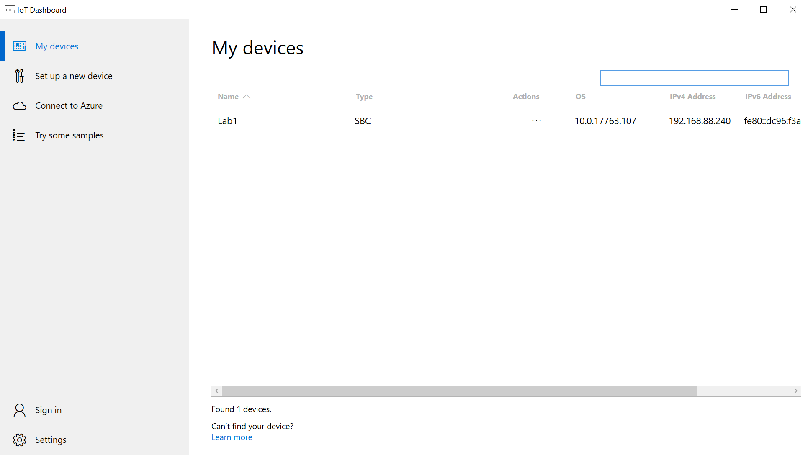

# Lab 01 - Getting started with Windows 10 IoT

This lab covers setting up Windows 10 IoT Core on a SolidRun HummingBoard Edge board and deploying apps using Visual Studio.

## Pre-requisites
### Hardware
* SolidRun HummingBoard Edge
* ?

### Software
* Visual Studio 2019 Community Edition (or above)

## 1 - Installing Windows 10 IoT Core with IoT Dashboard

Devices running Windows 10 IoT Core can be installed and configured using the IoT Dashboard. This tool makes it simple to get started and also provision Azure connectivity.

### 1.1 - Installing IoT Dashboard

1. Open a browser window to: [http://go.microsoft.com/fwlink/?LinkID=708576](http://go.microsoft.com/fwlink/?LinkID=708576)
1. Launch the IoT Dashboard and verify the application starts correctly



### 1.2 - Installing Windows 10 IoT Core

1. Insert Micro SD card into host PC 

1. Dismiss any messages to format the drive. Close those windows.  
1. Open IoT Dashboard and click 'Setup a new device'
1. Change the device type to 'NXP [i.MX6/i.MX7/i.MX8]' and set the OS Build to 'Custom'
1. Browse to the FFU file downloaded earlier
1. Add a password. We recommend "p@ssw0rd" as it is used later in the labs. 
1. Accept the license agreement and click 'Install'
1. When completed Windows Explorer will open the many windows. Dismiss any messages and close those windows. 


### 1.3 - Plugging in your hardware
1. Plug the HDMI adapter into your Hummingboard and the USB end into the USB Hub attached to your PC. 
1. Plug the blue USB cable into your SensorTile and the other end into the USB Hub.
1. Plug in the ethernet cable to your Hummingboard.
1. Insert the SD Card into your Hummingboard.
1. Insert the Power Cable into your Hummingboard.
1. On your Lab PC, open the Camera application to view the output of your Hummingboard as it boots. Select the camera cycle button to view the capture card. 

### 1.4 - Validating your install

1. Once the HummingBoard has completed booting, a line entry will show in the IoT Dashboard as above
2. Right click on your device and select 'Device Portal' - **Note: if your device doesn't show, in the list, read the IP Address from the display and enter that in your browser on port 8080. For example: http://192.168.88.200:8080**
3. In your browser enter the default username and password:

|Name    |Value|
|--------|-----|
|Username|Administrator|
|Password|p@ssw0rd|


4. Open the Processes Menu, Select Run command
5. Type "devcon status USB\VID_0483*" and hit enter to see if the device can see the connected SensorTile
6. You should see Name: USB Serial Device with status of Running


## 2 - Deploying apps to HummingBoard

### 2.1 - Hello world

1. Open up the first lab project found in [C:\Labs\content\src\IoTLabs.HummingBoard\IoTLabs.HummingBoard.sln](file:///C:\Labs\content\src\IoTLabs.HummingBoard.sln) 
2. Update the target system architecture to say 'ARM' as shown in the image below

3. Change target system from 'Local' to 'Remote Machine' and enter the IP address of your device. This can be found on the screen of your device

4. Run the project to test it on your HummingBoard. You should see an interface, however no data should be showing - **Note: the first deployment can take a few minutes**


## 3 - Publishing your app _(optional)_

1. In Visual Studio, in the Solution Explorer tab on the right, click on MainPage.xaml 
2. Click ```Project > Store > Create App Packages...```

3. Choose "I want to create packages for sideloading" and uncheck "Enable automatic updates"

4. Select "Never" on "Generate app bundle" and select "ARM" as the Architecture 

5. After package creation, click on the link to verify the .appx files have been created


## 4 - Sideload custom MSIX packages _(optional)_

1. TODO: Flesh these out properly
1. Use portal to delete existing app
1. Install new app from msix packages

Once you've confirmed the appx file has been created, you can move onto the next lab: [2 - Integrating Windows IoT with Azure](./Lab02.md)

