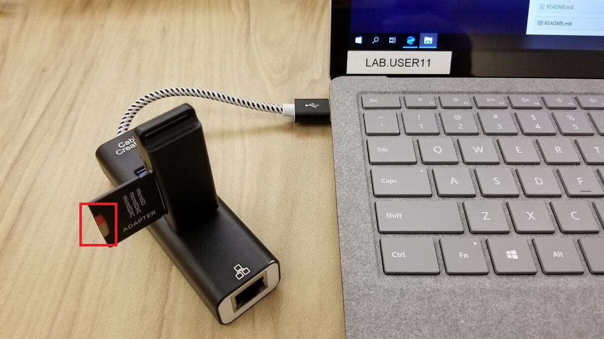

# Lab 1a - Getting started with Windows 10 IoT

This lab covers setting up Windows 10 IoT Core on a SolidRun HummingBoard Edge board and deploying apps using Visual Studio.

## Pre-requisites
### Hardware
* SolidRun HummingBoard Edge
* MicroSD Card and Adapter 
* STM SensorTile.Box
* Optional: USB HDMI Capture Card 

### Software
* Windows 10 IoT Core Dashbaord 
* Windows 10 IoT Core Firmware

## 1 - Installing Windows 10 IoT Core with IoT Dashboard

Devices running Windows 10 IoT Core can be installed and configured using the IoT Dashboard. This tool makes it simple to get started and also provision Azure connectivity.

### 1.1 - Installing IoT Dashboard

1. **If you already have Windows 10 IoT Core Dashboard on your desktop, you can skip this step and move on to '1.2 Installing Windows 10 IoT Core'**

1. Open a browser window to: [http://go.microsoft.com/fwlink/?LinkID=708576](http://go.microsoft.com/fwlink/?LinkID=708576)  This will install a file to setup the data and tools required for the labs.  
1. Double click on the setup.exe file which will launch the IoT Dashboard and verify the application starts correctly (by seeing the screen appear as shown below).

### 1.2 - Installing Windows 10 IoT Core

1. Ensure your Hummingboard device power is unplugged. 

1. Take the Micro SD card and put it in the card reader. Ensure it's **not in the HummingBoard**, then plug the card reader into your PC. 

1. Dismiss any messages to format the drive. Close all those windows that pop up.  

1. Open IoT Dashboard by typing **iot core** at the start menu

1. Click **Setup a new device**

1. Using the drop-down list, change the device type to **NXP [i.MX6/i.MX7/i.MX8]** and set the OS Build to **Custom**.

1. Browse to the FFU file found in `C:/Labs`

1. Name your device 'Lab-UserXX', where the XX referes to user number assigned to you. (found on the lower left of your lab pc screen)

1. Add a New Administrator password "p@ssw0rd", and confirm.  

1. Accept the license agreement and click **Install**.

11. Windows Explorer may prompt you to format the drive, this message can safely be ignored, press **Continue**.  Allow the software to make changes to your device, if asked.
1. It may take a few minutes for the Micro SD card to provision.
1. Once complete, remove the Micro SD card from the adapter.

### 1.3 - Plugging in your hardware

1. Plug the Micro USB cable into your SensorTile and the other end into the HummingBoard (not your PC).

1. Plug in the ethernet cable to your HummingBoard.

1. Insert the Micro SD Card into your HummingBoard.

1. Plug the HDMI adapter into your HummingBoard and the USB end into the USB Hub attached to your PC. 

### 1.4 - Booting your device

1. On your Lab PC, open the Camera application to view the output of your HummingBoard as it boots. 

1. Select the camera cycle button, found in the top right corner of the Camera App, and select the capture card.

1. Insert the Power Cable into your HummingBoard. 

1. The HummingBoard will begin its initial setup. 

**Note:** This initial boot process takes 3-5 minutes. It may reboot a couple times while it processes the initial setup. During boot you will see various screens that may take a minute before they proceed. If you see a Windows logo during this process thats a good sign. Once it reaches the Out of Box Experience (OOBE) you are ready to conitnue.  

**Note: You can not interact with the IoT Core using your screen, mouse or keyboard. It is just a HDMI display being shown on your Lab PC. The setup does not require any user input; it will automatically step through the OOBE screens.**

**Hint:** If you get the order wrong, unplug and plug back in the Power Cable into the HummingBoard to reboot the device and for the display to capture to your camear app.

### 1.5 - Validating your install

1. Once the HummingBoard has completed booting, a line entry will show in the IoT Dashboard. You can leave this window open to be notified when the device is ready. 

2. Right click on your device and select **Open in Device Portal** 

**Note:** if your device doesn't show in the list, look at the HDMI output from the device to ensure it's fully booted, and read the IP Address from the display and enter that in your browser on port 8080. For example: http://192.168.1.40:8080

3. In your browser enter the default username and password, that we just set:

|Name    |Value|
|--------|-----|
|Username|Administrator|
|Password|p@ssw0rd|

You should now have a working IoT device with Windows 10 IoT Core installed, along with screen output being shown through the HDMI capture card to the Windows Camera app acting as a second screen. 

Now you can proceed to deploying the UWP Gateway application

Lab 1b [Deploy Apps to your device via Sideloading](./Lab01b_Install_Gateway_Software.md)

or

Lab 1c
[Deploy Apps to your device with Visual Studio](./Lab01c.md)

Troubleshooting Display 
-----------------------

1. If you are having issues with the HDMI capture card then another way to see what is on the screen of the IoT device is to use the inbuilt **Screenshot** command on the Windows Device Portal. 

2. Select **Device Settings** on the Windows Device Portal, in the bottom right press the **Screenshot** button. Try it twice if it shows the broken image icon the first time.
   

3. An additional tool you can used is installed on your lab PC that can assist in taking screenshots. On your PC start menu type "Aware" and select the Screenshot tool. 
 

4. Type in your IP address and select Get Screenshot. Refresh as often as you like to see updated images of what is in the device screen. 

