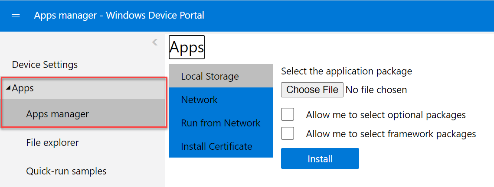
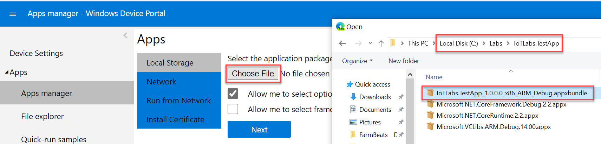
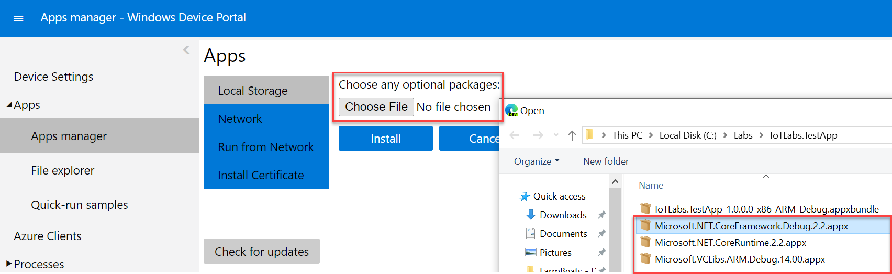
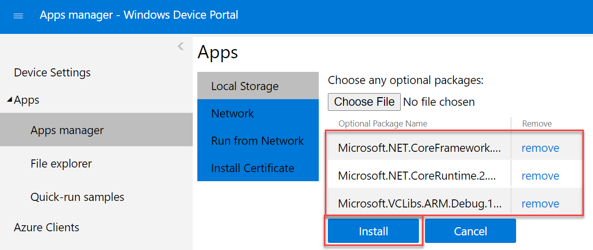
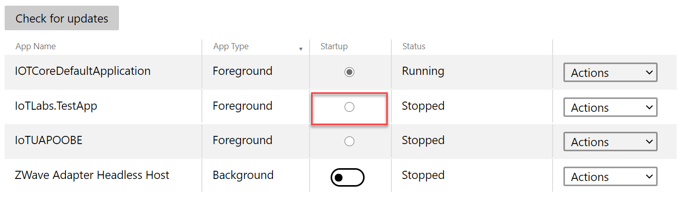
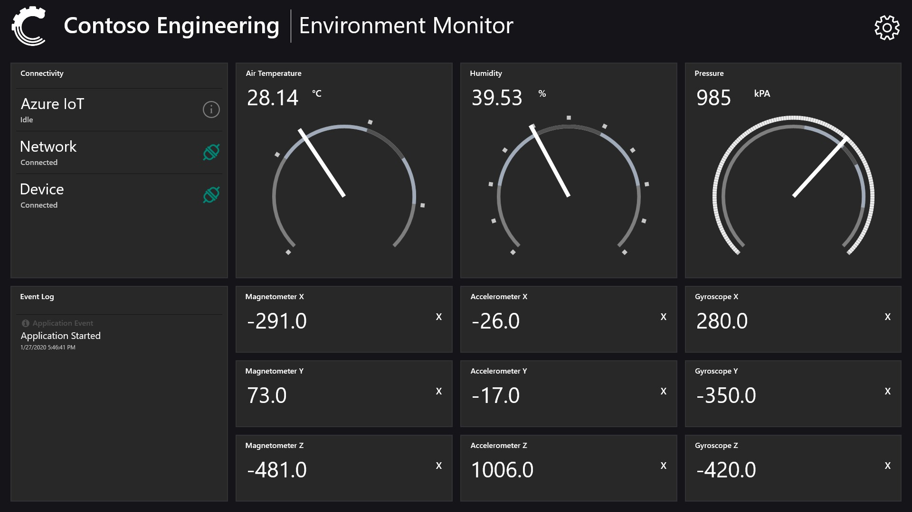
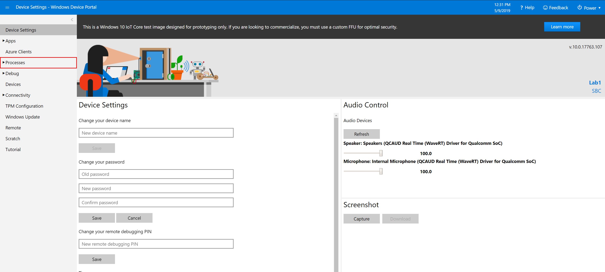
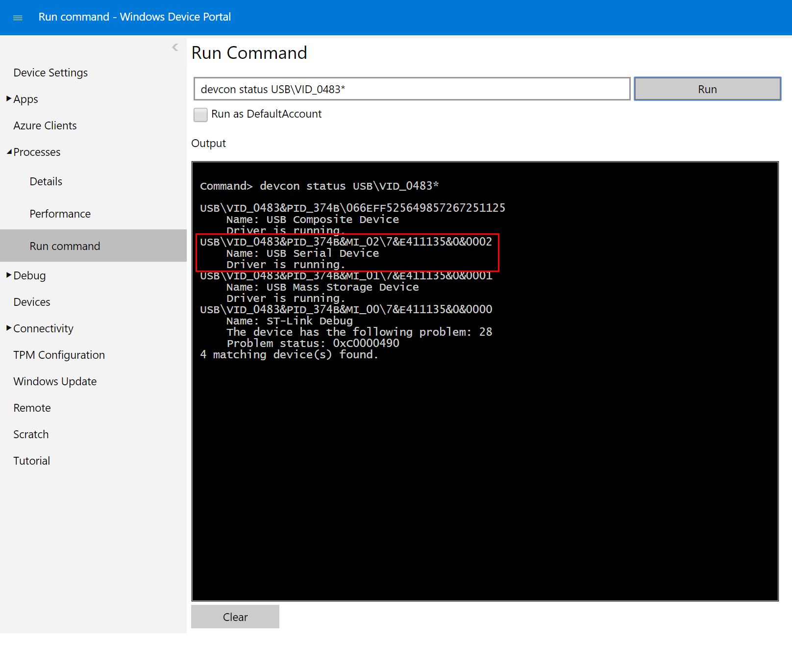
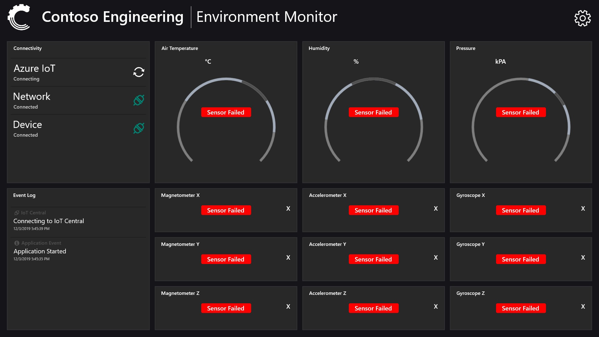
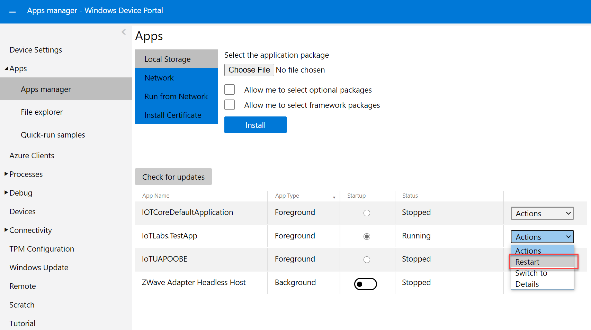

# Lab 1b - Install the Sensor Gateway Application Software
-------------------------------------------------

The sensor application is the piece of software that reads the values from the sensors and sends them to the cloud. The sensor application is critical to the supply of data from the device and into Azure IoT Central.

Preparation
-----------

Before going through the installation guide below, ensure that your device is connect to the internet and you have retrieved your device IP address. 

**Open the App Manager in the Windows Device Portal**

1. Open the Windows Device Portal. This can be done by opening a web browser and typing in your device IP address (found in previous step by step instructions) followed by 8080 (eg. http://192.168.1.60:8080)

1. In the Windows Device Portal, Select **Apps** on the left menu and then **App manager**

**Install the Sensor Application Software**

1. Select **[Choose File]** button in the **“Select the application package”**

1. Browse to the location of the downloaded files in **C:\Labs\IoTLabs.TestApp** and select the file ending in starting with **IoTLabs.TestApp** and ending in **.msixbundle**.

1. Select the **“Allow me to select optional packages”** and click **Next**

1. Select the **[Choose File]** button, and select Microsoft.NET.CoreFramework.Debug.2.2.appx

1. Select the **[Choose File]** button, and select Microsoft.NET.CoreRuntime2.2.appx

1. Select the **[Choose File]** again, and select Microsoft.VCLibs.ARM.Debug.14.00.appx

1. Click the **Install** button

6. The application will take a little while to upload and then will pause while it installs. When it has finished installing it will give you a **“Package Successfully Registered”** message at the end with it’s complete.

7. Click **Done**

8. The application should now show up in the Apps list.

9. You should now be able to select the app to startup when the device boots. 

10. View the camera app on you Lab PC or take a screenshot in the Windows Device Portal to see the application start. 

Software Installation Complete
------------------------------

You have successfully installed your Windows 10 IoT Core sensor device and software.

When the application loads correctly you should see sensor data on the screen. If there are red lines on the sensors, unplug the sensor and plug it back in again. 

Now proceed to **Lab 2 – Connect your device to Azure IoT Central**
[Connect your device to Azure IoT Central](./Lab02.md)

Troubleshooting SensorTile
----------------------------------

1. To test the SensorTile is connected. Make sure it's plugged into the Hummingboard, then open the Processes Menu, Select Run command

2. Type **"devcon status USB\VID_0483\*"** and hit enter to see if the device can see the connected SensorTile

3. You should see **Name: USB Serial Device** with status of Running

4. If there are still red lines on the sensors then use the Windows Device Portal App Manager to restart the application. 

