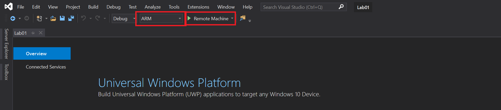
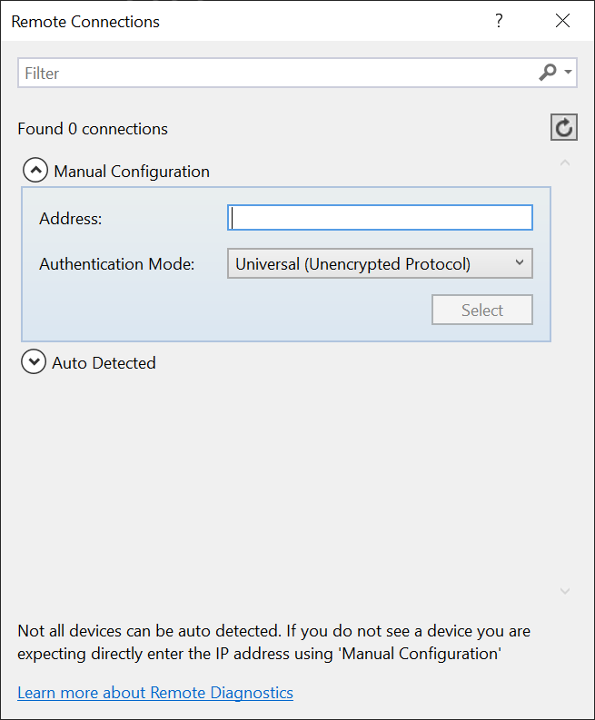
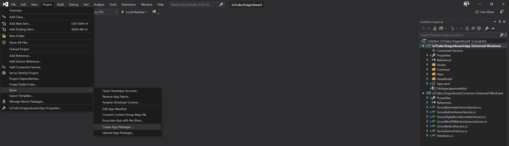
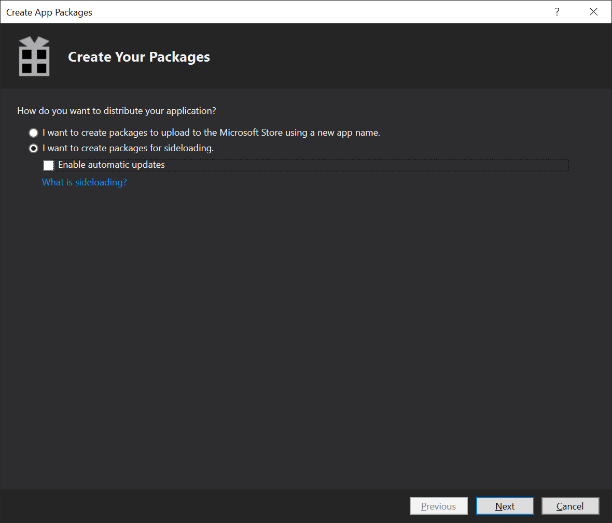
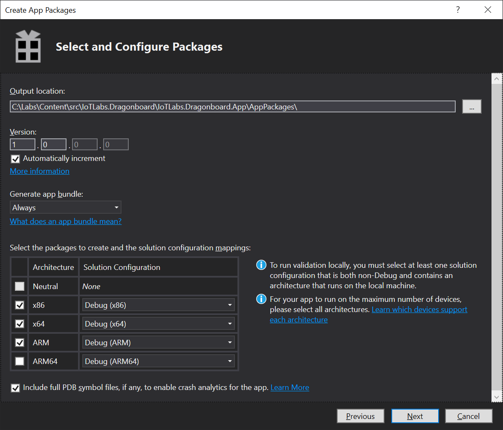
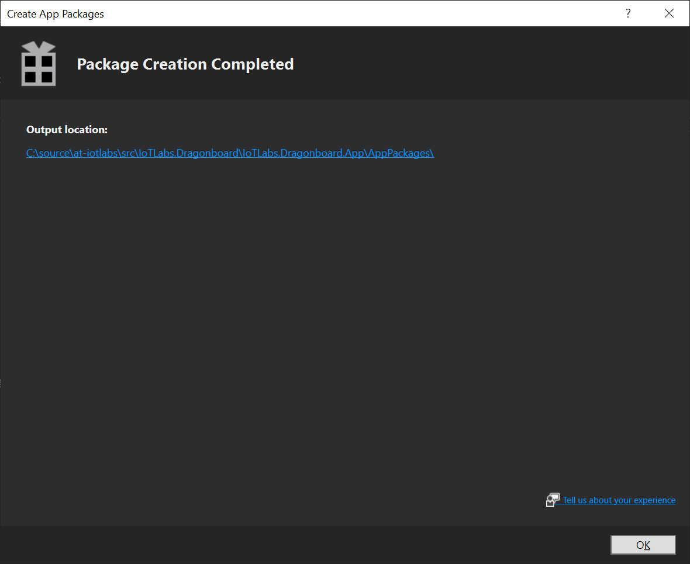

# Lab 01c - Deploy Apps to your device with Visual Studio 

## 1 - Deploy and debug with Visual Studio 2019

1. Open up the first lab project found in [C:\Labs\content\src\IoTLabs.TestApp\IoTLabs.TestApp.sln](file:///C:\Labs\content\src\IoTLabs.TestApp\IoTLabs.TestApp.sln)  

2. If prompted to log in with VisualStudio, simply close the window as no sign in is required.

3. Update the target system architecture to say 'ARM' as shown in the image below


4. Change target system from 'Device' to 'Remote Machine' and enter the IP address of your HummingBoard device. This can be found on the camera screen showing your HummingBoard device. It may already be listed in the **Auto Detected**


5. Run the project back in VisualStudio (by pressing the green arrow beside the Remote Machine) to test it on your HummingBoard. 

**Note:** the first deployment can take a few minutes.  You will know it has finished with the status message in the lower left corner of the app shows 'READY'. Then you should the app starting on your HummingBoard. 

**Hint:** If no sensor data is displayed, try changing the USB port the SensorTile is connected through to another port on the HummingBoard. Stop the application in Visual Studio using the STOP button, then press the START button again. 


## 2 - Publishing your app as an .appx bundle for side loading 

1. In Visual Studio, in the Solution Explorer tab on the right, click on Dashboard.xaml 

2. Click ```Project > Publish > Create App Packages...```
v

3. Choose to distribute the application by **Sideloading** and uncheck "Enable automatic updates".  Click **Next** and leave the defaults for the 'Select signing method', click **Next** again.


4. Select "Never" on "Generate app bundle" and select "ARM" as the Architecture 


5. After package creation, click on the link to verify the .appx files have been created


Once you've confirmed the appx file has been created, you can move onto the next lab: [2 - Integrating Windows IoT with Azure](./Lab02.md)