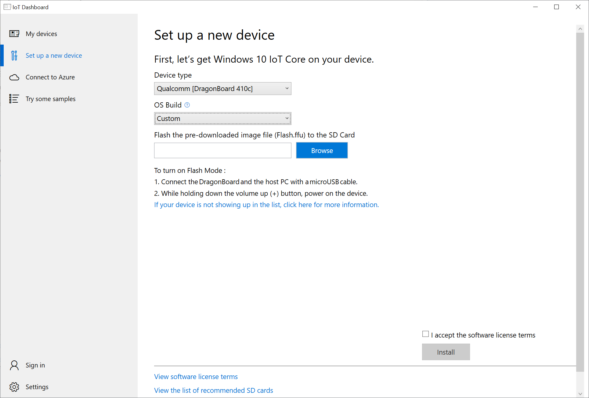

# Lab 02 - Creating a custom FFU

## Pre-requisites
### Hardware
* Arrow Dragonboard 410c
* Grove LED
* Grove Button

### Software
* Visual Studio 2019 Community Edition (or above)
* Dragonboard 410c - BSP Package https://developer.qualcomm.com/hardware/dragonboard-410c/software
* Windows Assessment and Deployment KiT (Windows ADK)
* Windows 10 IoT Core packages
* IoT Core ADK Add-Ons
* IoT Core PowerShell environment
* Dragonboard update tool

## 1 - Build your image

Microsoft enables device manufacturers and OEMs to design their own IoT Core images. These images are built using an IoT Workspace and customized using Board Support Packages (BSPs) containing drivers, apps and other additions.

### 1.1 - Create your workspace

1. Open ```C:\labs\iot-adkaddonkit``` and run the script named ```IoTCorePShell```.
1. In the PowerShell window, type the following commands:

```
New-IoTWorkspace -DirName "C:\labs\workspace" -OemName "lab02" -Arch "arm"
Import-IoTOEMPackage *
```

### 1.2 - Install Board Support Package (BSP)

1. Run the following PowerShell commands in the console from the previous step to enable Dragonboard 410c support on the IoT Core image:

```
$productName = "ProductA"
$bspName = "410c"

Import-IoTBSP -BSPName $bspName -Source "db410cetcetc.zip"
Add-IoTProduct -ProductName $productName -BSPName $bspName
```

### 1.3 - Add Universal Windows App

1. Run these PowerShell commands to inject the app from the previous lab into the image:

```
#StartupType "fga" means Foreground App

$appName = "Appx.DragonboardTest"
$configName = "Test"

Add-IoTAppxPackage -AppxFile "C:\labs\Dragonboard\APPNAMEHERE" -StartupType "fga" -OutputName $appName
New-IoTCabPackage -PkgFile $appName
Add-IoTProductFeature -Product $productName -Config $configName -FeatureID "APPX_MYUWPAPP" -OEM
```

### 1.3 - Compile FFU image

1. Run these PowerShell commands to compile the workspace into an FFU image:
```
New-IoTCabPackage -PkgFile "All"
New-IoTFFUImage -Product $productName -Config $configName
```

## 2 - Install custom image

### 2.2 - Installing custom image

1. Connect Dragonboard to host PC with a Micro-USB cable
1. Hold down the 'Volume Up (+)' button while plugging in the power adapter into the Dragonboard
1. Open IoT Dashboard and click 'Setup a new device'
1. Change the device type to 'Qualcomm \[Dragonboard 410c\]' and set the OS Build to 'Custom'
1. Browse to the custom FFU file generated in the previous steps
1. Accept the license agreement and click 'Install'



### 2.3 - Validating your install

1. Once the Dragonboard has completed installing, a line entry will show in the IoT Dashboard as above
2. Right click on your device and select 'Device Portal'
3. In your browser enter the default username and password:

|Name    |Value|
|--------|-----|
|Username|Administrator|
|Password|p@ssw0rd|


4. Enter a name in the 'Change your device name' text box and click 'Save'. Your device should reboot and display the new name 