# Lab 02 - Integrating Windows IoT with Azure

## Pre-requisites
### Hardware
* Arrow Dragonboard 410c
* Grove LED
* Grove Mini PIR Sensor
* Grove Barometer Sensor

### Software
* Visual Studio 2019 Community Edition (or above)


## 1 - Deploying Azure IoT Hub

### 1.1 - Deploy Azure IoT Hub

1. Sign into the [Azure Portal (https://portal.azure.com)](https://portal.azure.com) with the supplied lab credentials
1. Click "Create a resource", search for "IoT Hub"
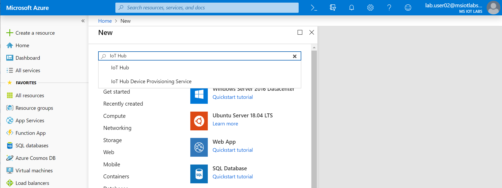
1. Click on "IoT Hub" and "Create"
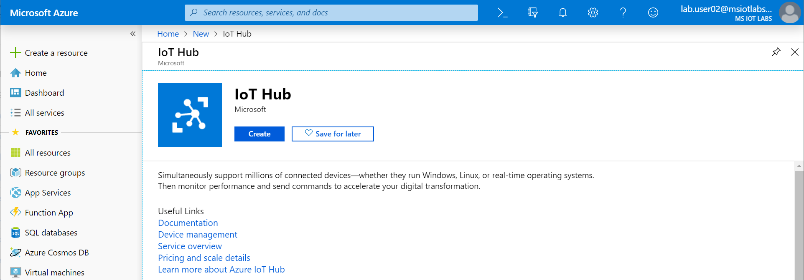
1. Fill out the details by choosing a name and select the existing subscription and resource group
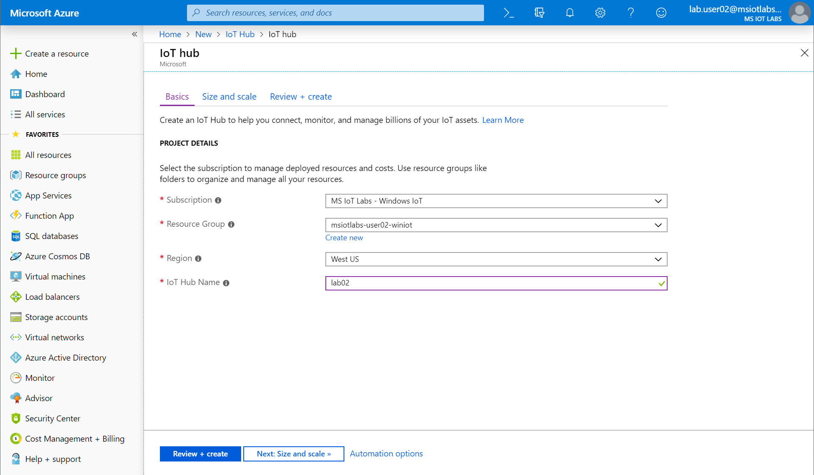
1. Click "Review + create" and finally "Create" to complete the provisioning
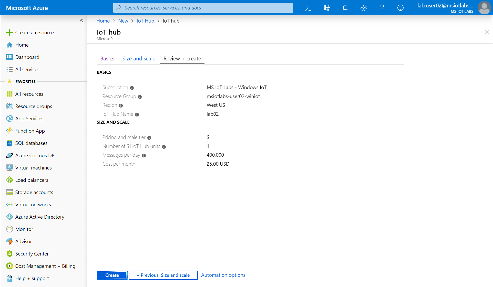

### 1.2 - Configure Azure IoT Hub

1. Click "Resource groups" on the left-hand menu, select the "winiot" resource group in the list and choose the IoT Hub previously created

1. Click "IoT devices" on the IoT Hub menu and click "Add"
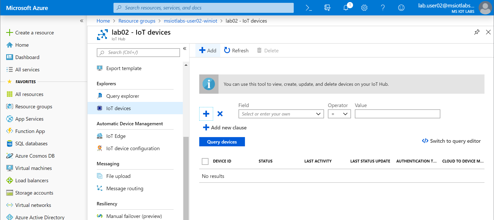
1. Enter "dragonboard" as the Device ID and click "Save" to create the device
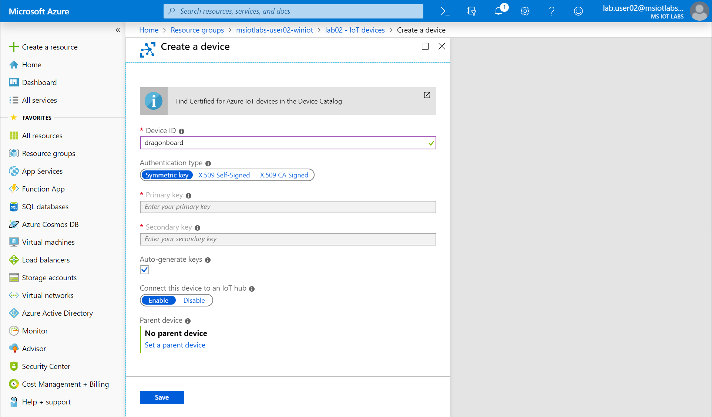
1. Click the device called "dragonboard" and copy the "Connection string (primary key)" field to the clipboard - we will use this later
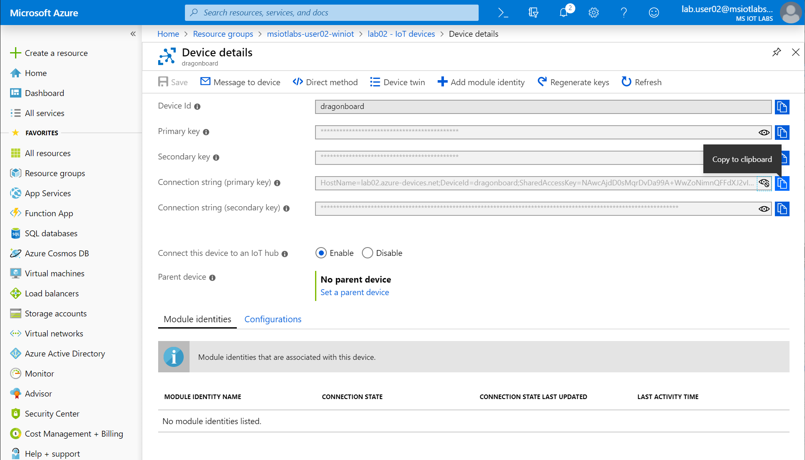

### 1.3 - Connect Dragonboard app to Azure IoT Hub

1. In Visual Studio, open ```ViewModel/MainViewModel.cs``` and browse to **line 221** 
1. Update the iotHubConnectionString with the text on your clipboard
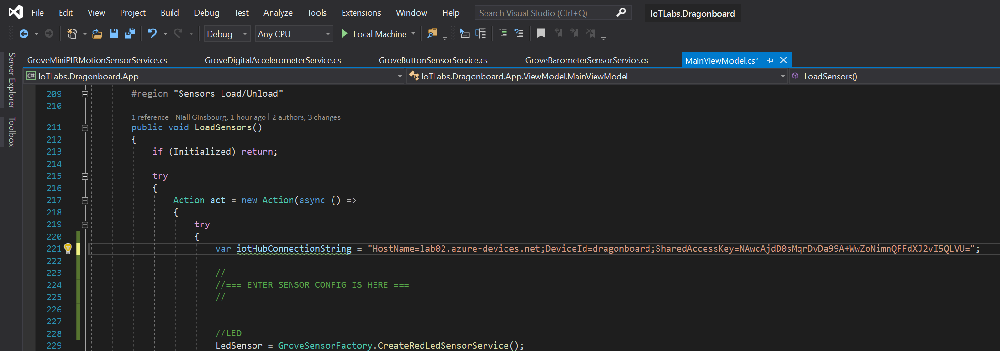
1. Start debugging to run the updated app on the Dragonboard

### 1.4 - Montior Azure IoT Hub events with Azure CLI

1. Open an Command Prompt as Administrator
1. Type the following commands to monitor messages from the Dragonboard:

```batch
az login
az extension add --name azure-cli-iot-ext
az iot hub monitor-events -n ENTERYOURIOTHUBNAME -d dragonboard
```

3. Watch the console window as telemetry messages start to stream through from the Dragonboard device

## 3 - Data visualization with Azure Time Series Insights (TSI)

### 3.1 - Deploying Azure Time Series Insights

1. Sign into the [Azure Portal (https://portal.azure.com)](https://portal.azure.com) with the supplied lab credentials
1. Click "Create a resource", search for "Time Series Insights" and "Create"
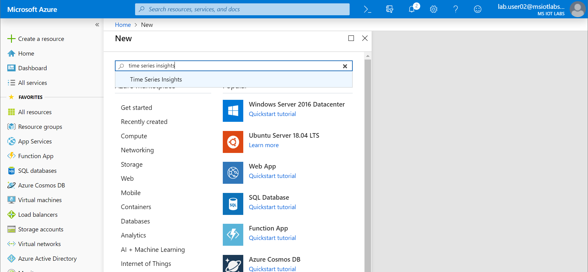
1. Set the fields as shown in the image below, then click "Next: Event Source"
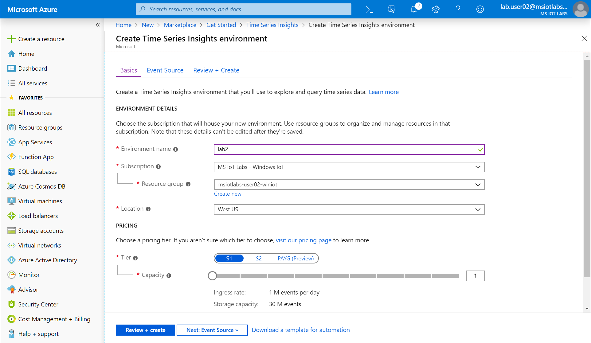
1. Set the Event Source fields as shown in the image below
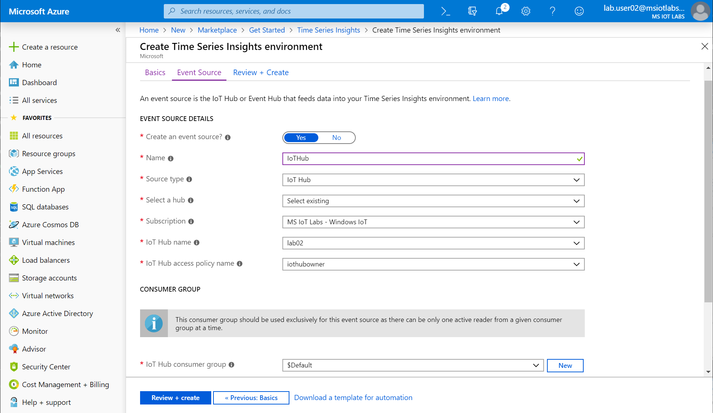
1. Add a new Consumer Group called "tsi" and click "Add"
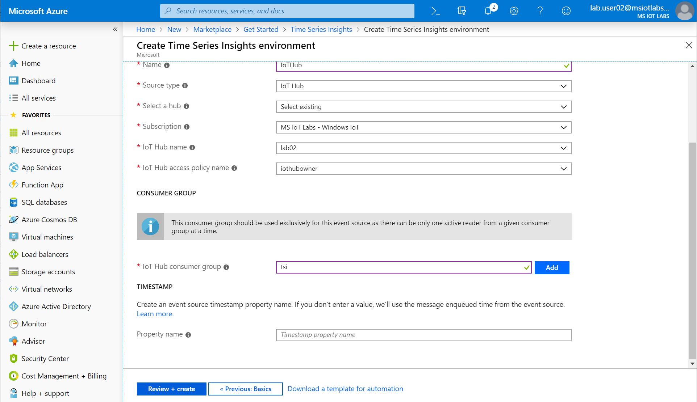
**Note: Make sure you click "Add" next to the Consumer Group before continuing**

### 3.2 - Configuring TSI

1. Open the [Time Series Insights Portal (insights.timeseries.azure.com)](https://insights.timeseries.azure.com)

## 4 - Republish appx files

1. Refer to Step 3 in Lab 1 to run through the steps in Visual Studio for publishing packages


With your new appx files you can move on to [Lab 3 - Creating a custom Windows IoT FFU](./Lab03.md)