# Lab 2 – Connect your device to Azure IoT Central

This lab covers setting up Azure IoT Central, creating a Device Template and adding your HummingBoard as a device. By the end of this Lab you should be able to monitor your HummingBoard device in the cloud.

## Pre-requisites

### Software
* Web Browser

## 1 - Deploying Azure IoT Central (IOTC)

### 1.1 - Create IOTC application

1. Navigate to [https://portal.azure.com/#create/Microsoft.IoTCentral](https://portal.azure.com/#create/Microsoft.IoTCentral) and log in with supplied lab credentials. 
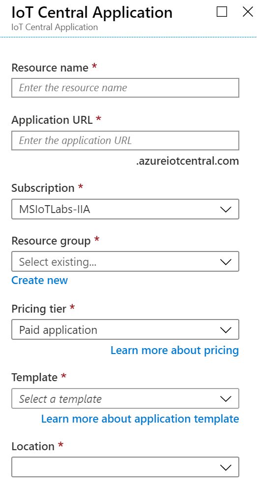

2. Click **New Application**, and choose the following settings, leaving other settings at their defaults.:

|Name    |Value|
|--------|-----|
|Resource Name|`[choose a unique name]`|
|Subscription|`MSIoTLabs-IIA`|
|Resource Group| `msiotlabs-iia-userXX` where `XX` is your users number. |
|Template|`Custom Application`|
|Region|`United States`|

3. Click **Create** to provision your application

4. Wait for the application to be deployed, this usually takes less than a minute. and then push the `Go to Resource` button.
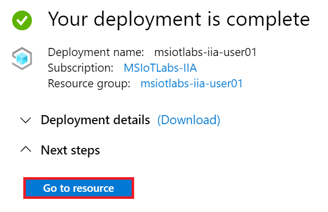

5. Click on the IoT Central Application URL to open your IoT Central Application. This URL will match the name you specified from step 2. You can also use the [apps.azureiotcentral.com](https://apps.azureiotcentral.com/myapps) portal to access your application.
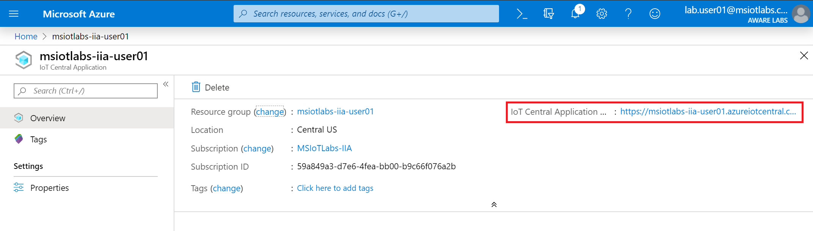

### 1.2 - Create Device Template

1. Navigate to Device Templates and click **New**

1. IoT Central can import existing Device Templates from the [Azure IoT Device Catalog](), however we are creating our own device. Click **IoT Device**. then the blue **Next: Customize** button at the bottom of the window.
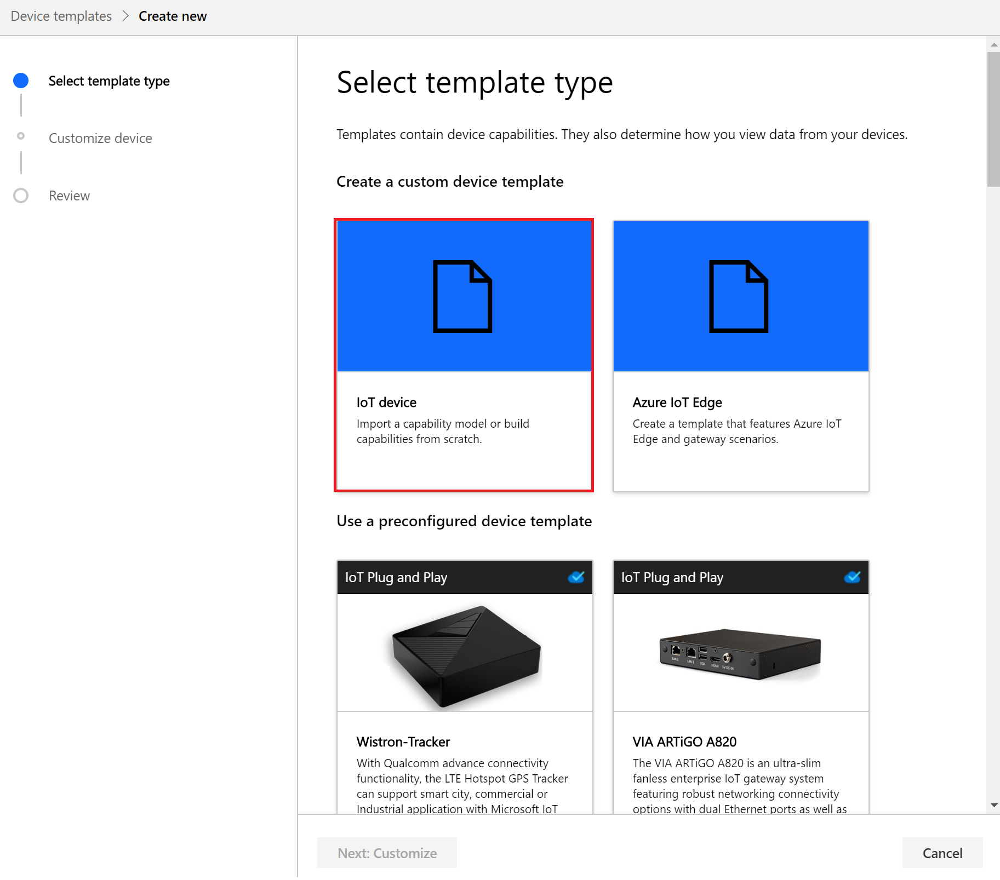

1. Leave the "Gateway Device" checkbox **unchecked**, click the **Next: Review** button, then click **Create**

1. Name your Device Template **SensorTile.box**, press Return 
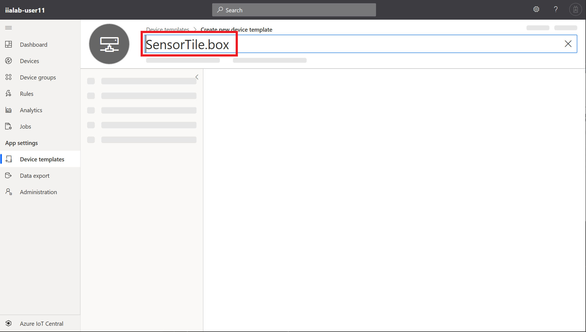

1. Click **Import Capability Model**.
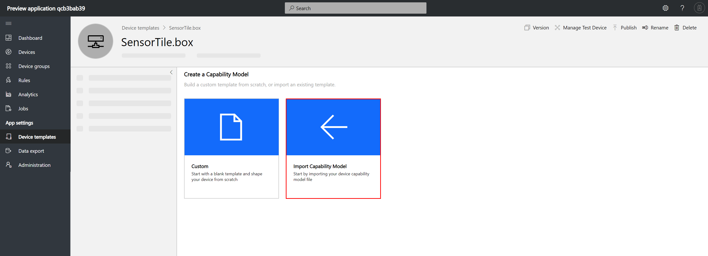

1. Browse to the `C:\Labs\Content\src\Azure.IoTCentral\` folder and upload the file named `ST SensorTile.Box.json`.
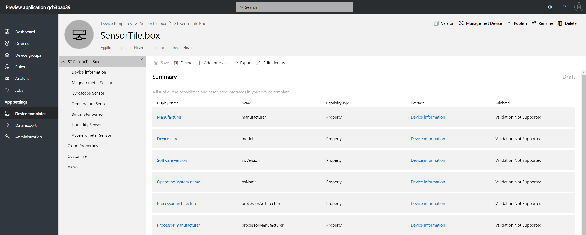

1. Click **Views** and click **Generate Default Views**, change nothing on the sceen and click **Generate Default Views** again.
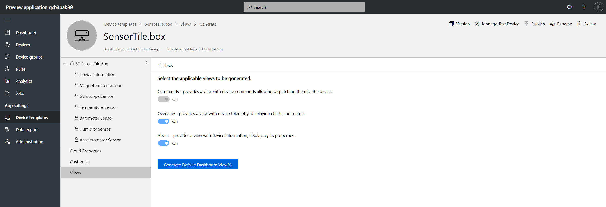

1. Click **Publish** (found at the top right) and confirm the process by clicking **Publish** again.
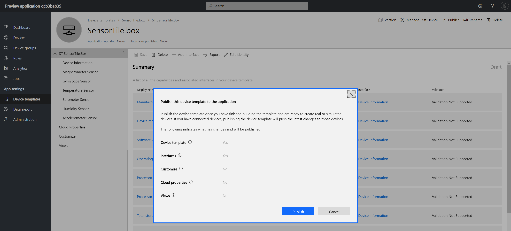

### 1.3 - Create Device from Template

1. Click **Devices**, choose your newly created Device Template and click **New**.
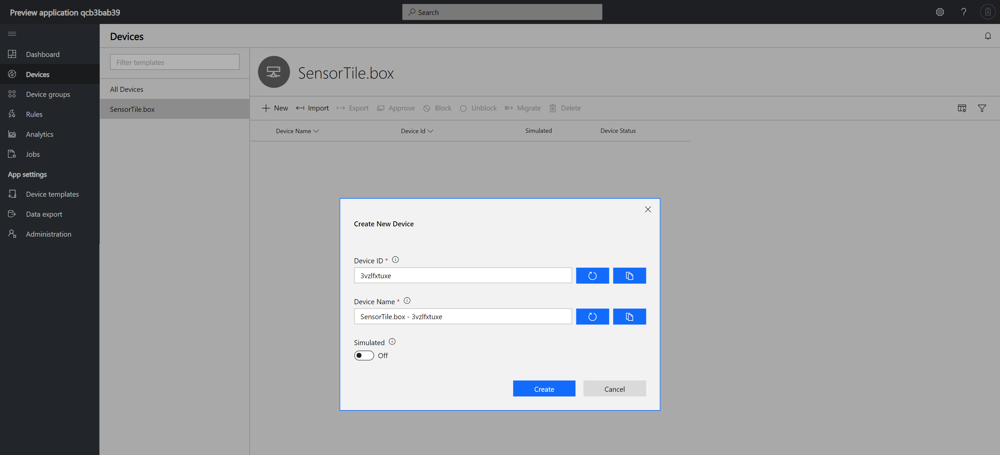

2. Confirm that the **Simulated** toggle is **unchecked**, then click **Create**.

3. Click on your new device to see the device dashboard. There should be no data showing yet.
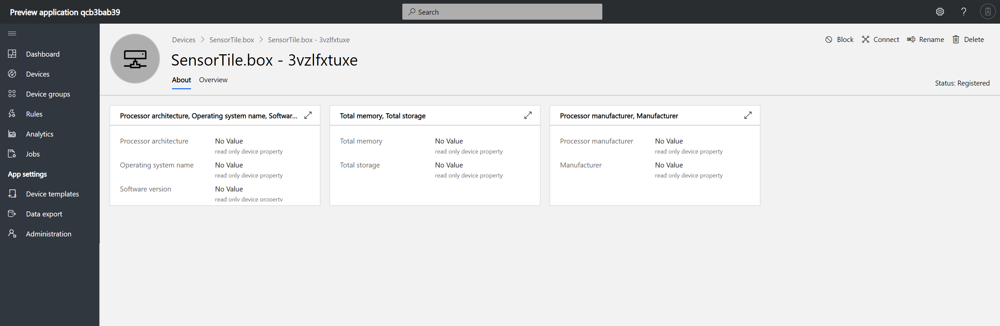

4. Click the **Connect** button and record the `Scope ID`, `Device ID` and `Primary Key` into the **notes** file which you can find on your desktop. These are the Azure IoT Hub Device Provisioning Service (DPS) details. You will need these to set up your device.
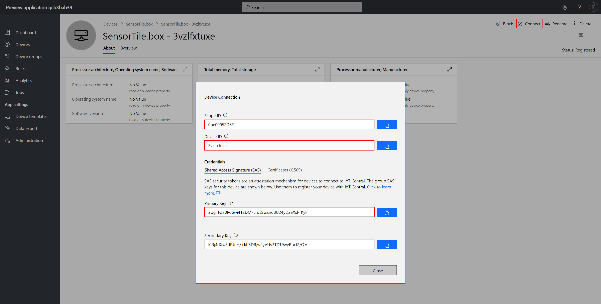

## 2 - Configure device to connect to IoT Central

### 2.1 - Prepare Azure IoT Hub Device Details
In order to connect the application with the IoT Hub we will need to generate a connection string, this could be done programmatically through a command line tool such as **dps-keygen**.  

We will be using the dpsgen.com website to generate a configuration file with a connection settings in a format the test application can consume.

1. Open a browser tab and navigate to [www.dpsgen.com/iia](https://www.dpsgen.com/iia).

2. Enter the `Scope ID`, `Device ID` and `Primary Key` collected earlier from the **notes** file on your desktop and click **Generate JSON**. 
1. Navigate to the download location for the tpmoverride.json file and open the file. If it is full of "null" that indicates that the dpsgen website had issues creating your connection string. In this case try again but if it still persists then you will have to use the [https://github.com/Azure/dps-keygen](https://github.com/Azure/dps-keygen) method.

3. Open a Command Prompt as Administrator.

4. Open Device Portal then select 'File Manager'
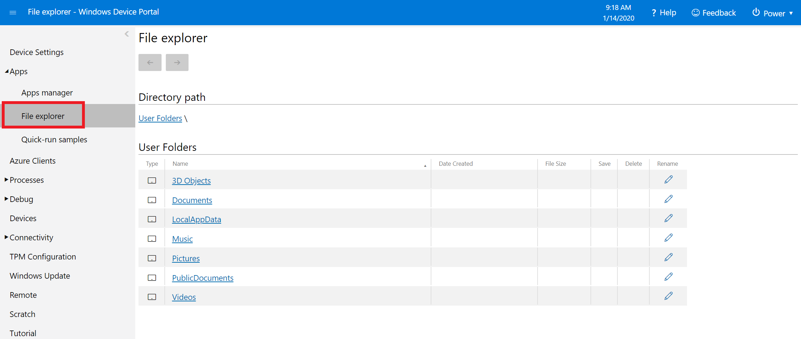

5. Browse to 'LocalState' folder of IoTLabs.TestApp.  
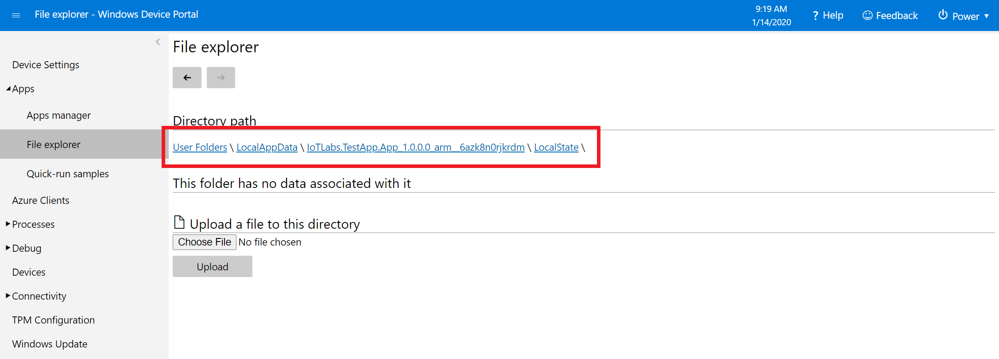

6. Select 'Choose File' and navigate to the 'tpmoverride.json' in 'Downloads' folder from step above, then click 'upload' to copy the JSON file to IoT Core.
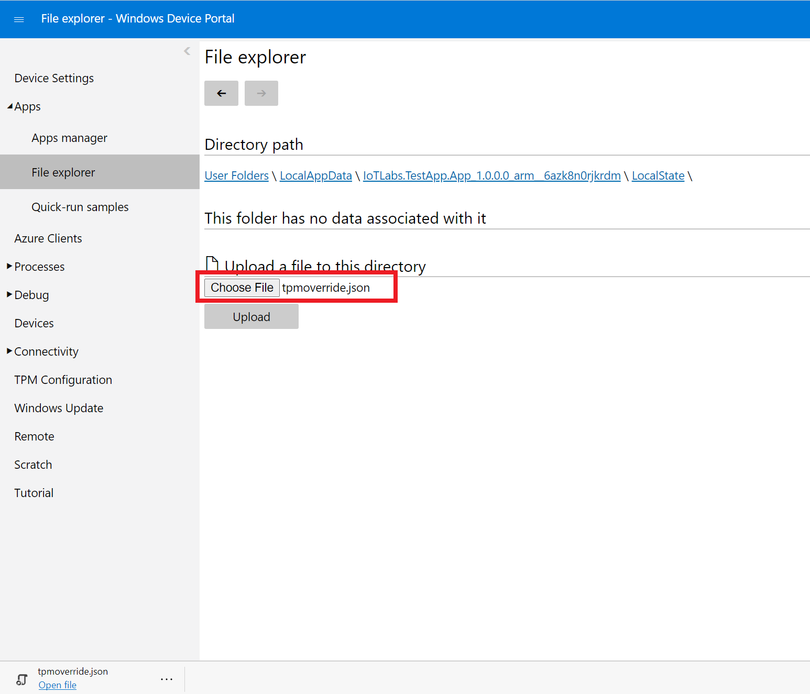

7. Use Visual Studio or Device Dashboard to stop and then restart the application. Once started you should see Azure IoT now showing as connected.
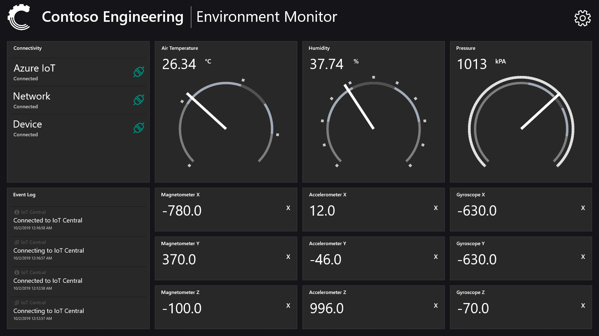

6. Switching back to IoT Central, you should be able to see data in the dashboard as well.
7. Select devices, and click on your device. 
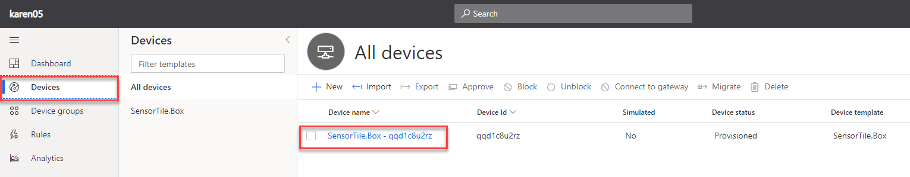

8. Then select overview to see your device dashboard which should be showing. 
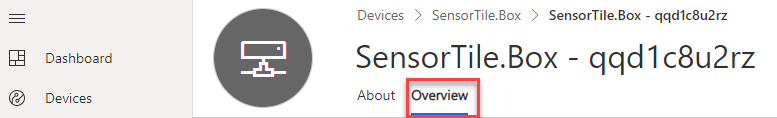

**Note:** If your dashboard is showing "Waiting for data" then the application is not securly connected to Azure and you should revisit the steps to copy the tpmoverride file.
