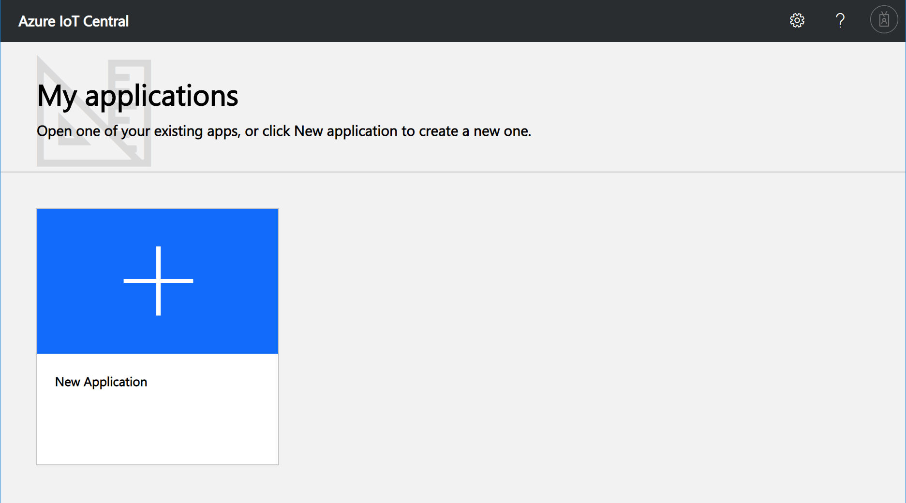
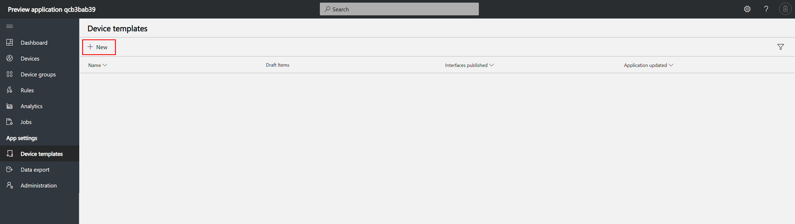
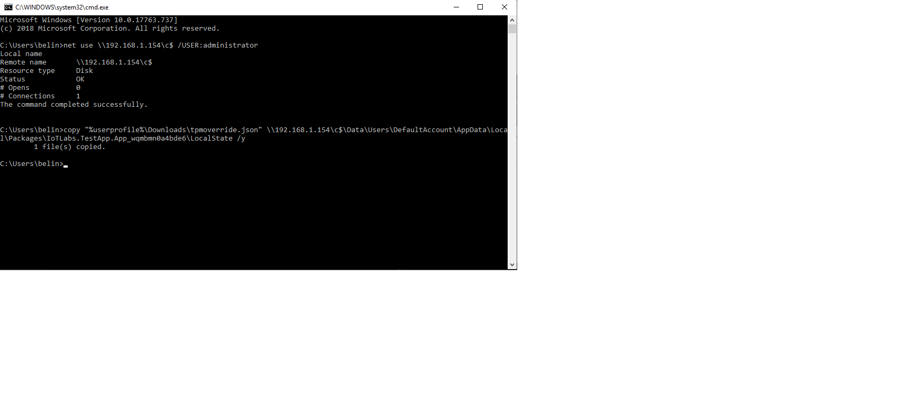

# Lab 02 - Integrating Windows 10 IoT with Azure IoT Central

## Pre-requisites

### Software
* Web Browser

## 1 - Deploying Azure IoT Central (IOTC)

### 1.1 - Create IOTC application

1. Navigate to [apps.azureiotcentral.com](https://apps.azureiotcentral.com) and log in with supplied lab credentials

2. Click "New Application", and choose the following settings:

|Name    |Value|
|--------|-----|
|Payment Plan|Pay-as-you-go|
|Application Template|Preview Application|
|Application Name|[choose a name]|

3. Click "Create" to provision your application


### 1.2 - Create Device Template

1. Navigate to Device Templates and click 'New'


1. IoT Central can import existing Device Templates from the [Azure IoT Device Catalog](), however we are creating our own device. Click 'Custom'.


1. Name your device and click 'Import Capability Model'


1. Browse to the `src/IoT Central/` folder and upload the file named `ST SensorTile.Box.json`.


1. Click 'Views' and click 'Generate Default Views'


1. Click 'Publish' and confirm the process by clicking 'Publish' again.


### 1.3 - Create Device from Template

1. Click 'Devices', choose your newly created Device Template and click 'New'.


2. Confirm that the 'Simulated' toggle is **unchecked**, then click 'Create'.

3. Click on your new device to see the device dashboard. There should be no data showing yet.


4. Click the 'Connect' button and record the `Scope ID`, `Device ID` and `Primary Key`. These are the Azure IoT Hub Device Provisioning Service (DPS) details. You will need these to set up your device.


## 2 - Configure device to connect to IoT Central

### 2.1 - Prepare Azure IoT Hub Device Details
1. Open a browser tab and navigate to [www.dpsgen.com/iia](https://www.dpsgen.com/iia).

2. Enter the `Scope ID`, `Device ID` and `Primary Key` collected earlier and click 'Generate'. 

3. Open a Command Prompt as Administrator.
4. Replace the IP address in the following commands with the IP Address of your device, then run the commands in your command prompt window:
```batch
net use \\<device ip address here>\c$ /USER:administrator
copy "%userprofile%\Downloads\tpm_override.json" \\<device ip address here>\c$\Data\Users\DefaultAccount\AppData\Local\Packages\IoTLabs.TestApp.App_wqmbmn0a4bde6\LocalState /y
```


5. Restart your application and you should see the IoT Hub connection show successful and data inside IoT Central