# Lab 3 – Deploy Azure IoT Edge on Windows 10 IoT Enterprise

## 1 - Deploy and configure Azure IoT components

### 1.1 - Provision Azure Resources

The focal point of all Microsoft IoT solutions is the Azure IoT Hub service. IoT Hub provides secure messaging, device provisioning and device management capabilities.

Azure Resource Manager Templates (ARM Templates) can be deployed into Azure that include IoT Hub. 

1. Open a browser and navigate to the [Azure Portal (portal.azure.com)](https://portal.azure.com). 
1. Log in with the lab credentials provided.  
**lab.user##@msiotlabs.com where ## are replaced with the number of your lab workstation. 
eg. #1 would be lab.user01@msiotlabs.com** 
1. Click the 'Deploy to Azure' button **below on this page** to create the Azure IoT components required for the next labs:<br/><br/>
<a href="https://portal.azure.com/#create/Microsoft.Template/uri/https%3A%2F%2Fraw.githubusercontent.com%2Fawaregroup%2FIIALab%2Fmaster%2Fsrc%2FAzure.ARM%2Fiia-azuredeploy.json" target="_blank" rel="noopener noreferrer">

</a>

3. You can also visualize an ARM template to see the components that will be created.<br/><br/>
<a href="http://armviz.io/#/?load=https%3A%2F%2Fraw.githubusercontent.com%2Fawaregroup%2FIIALab%2Fmaster%2Fsrc%2FAzure.ARM%2Fiia-azuredeploy.json" target="_blank" rel="noopener noreferrer">

</a><br/><br/>

2. Choose the **Resource group** that matches your lab user number, click **I agree** on the terms and **Purchase** to begin the provisioning process.
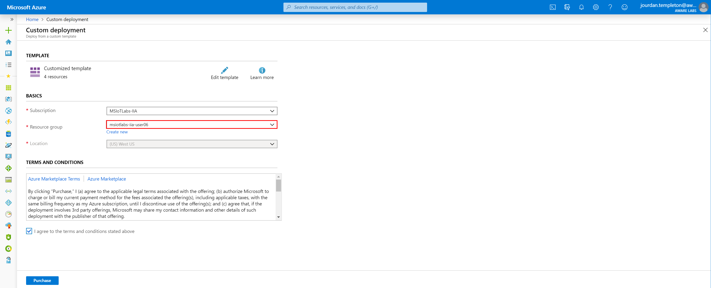

3. Wait for the provisioning process to complete.

### 1.2 - Validate Resources

1. On the left hand icon menu, click 'Resource Groups'
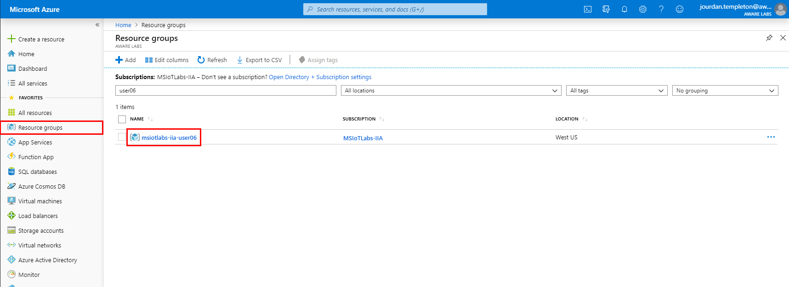

2. Click on the resource group that corresponds to your username
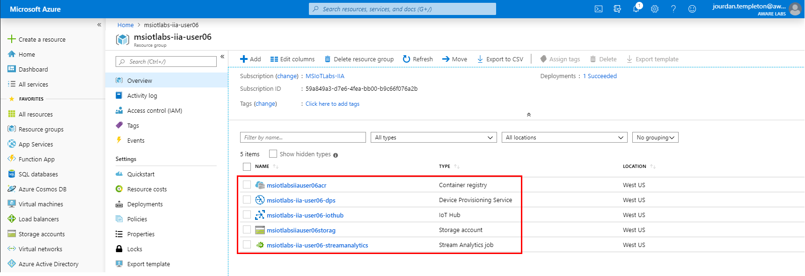
3. Validate that you can see the following types of resources:<br/>
* Container Registry
* Device Provisioning Service
* IoT Hub
* Storage Account
* Stream Analytics Job

These components represent the IoT platform your device connects to.

## 2 - Explore Resources

### 2.1 - IoT Hub

IoT Hub is the core of all IoT projects in Azure. Open your IoT Hub resource **msiotlabs-iia-user##-iothub** and explore the different pages that are listed in the table below:

|Component    |Description|
|--------|-----|
|Shared Access Policies|IoT Hub has a specific focus on security and this is one of the areas to configure access to the management of the IoT Hub. |
|IoT Devices|This device list allows you to see all the devices that are currently registered against the IoT hub and manage them. You can also check the metadata for each device including their Device Twin.|
|IoT Edge|This is an important component for the labs further on. This allows you to manage your IoT Edge devices in a similar fashion to the IoT Devices.|
|Message Routing|Core to IoT Hub is a messaging platform - the ability to send messages from the Device-to-Cloud and Cloud-to-Device. Message routes allow you to forward device messages to other Azure services. There is a route configured in this solution that allows the telemetry to flow through to Time Series Insights.

**Hint:** In preparation for the next step in the lab, using the breadcrumb trail (at the top middle of the screen) click on **msiotlabs-iia-user##** resource group to take you back to your resource group.


### 2.2 - Device Provisioning Service (DPS)

The Device Provisioning Service is found in your resource group **msiotlabs-iia-user##** (see Hint in the previous step if stuck).

DPS allows devices to be embedded with an organization specific key, that allows them to register against a specific IoT Hub on first boot. This enables device builders to easily manufacture a fleet of devices and have them register against centrally managed IoT Hubs.

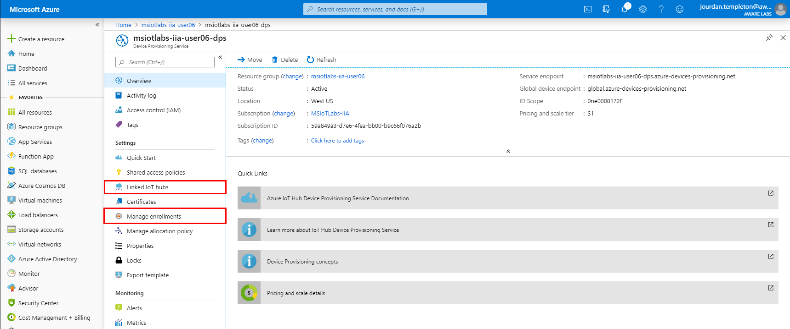

|Component Name    |Notes|
|--------|-----|
|Linked IoT Hubs|DPS has the ability to enrol a device in a specific IoT Hub. You'll notice that the deployed template has connected DPS to the existing IoT Hub.|
|Manage Enrollments|Devices that have enrolled show up in this list. You can check this area again in a future lab.|

**Hint:** Once again for the next step, using the breadcrumb trail (at the top middle of the screen) click on **msiotlabs-iia-user##** resource group to take you back to the higher level.

### 2.3 - Stream Analytics (Edge)

Stream Analytics is a fully managed Platform as a Service (PaaS) offering on Azure, designed to analyze and process high volumes of fast streaming data from multiple sources simultaneously. It is available both in the Cloud and at the Edge.

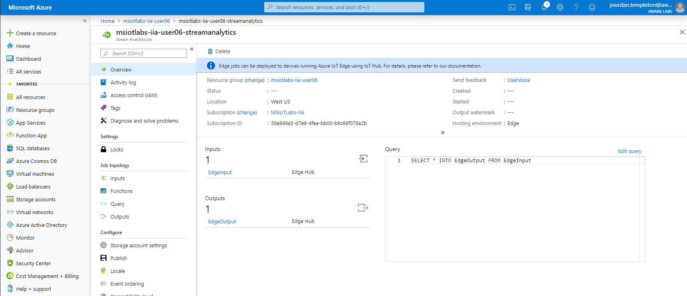

|Component Name    |Notes|
|--------|-----|
|Query|Stream analytics allows you to write a query that is applied to the data streaming through. In a future lab we will modify this query.|

The Edge version of Stream Analytics allows us to run this service inside a container on our Edge Device. 

**Hint:** Jump back to **msiotlabs-iia-user##** resource group once again in preparation for the next step as you have done previously.

### 2.4 - Container Registry

Container Registry is a private docker container registry that you can push containers to. When combined with IoT Edge, you can store the containers to be used by your edge devices. Your proprietary code can stay protected in your own container registry rather than a public registry. Take note of your **container registry name** with the **notes** file on your desktop, We will be using it in Lab05.

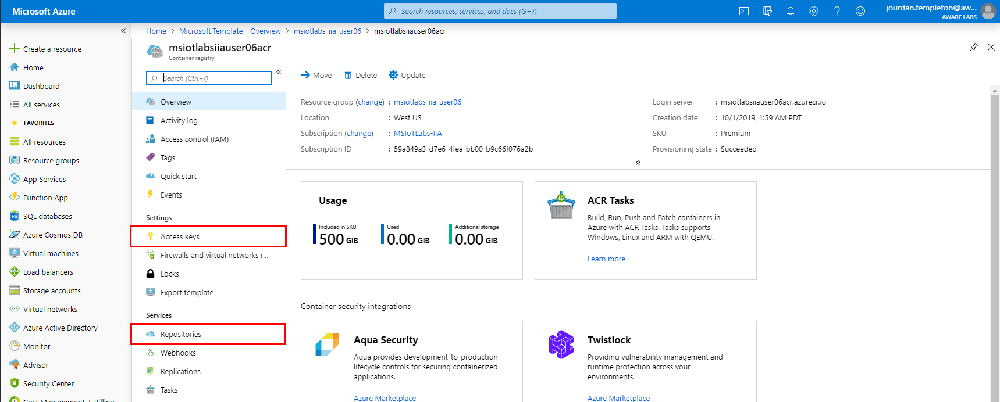

|Component Name    |Notes|
|--------|-----|
|Repositories|Contains all the repositories with containers and tags currently pushed to the Container Registry.|
|Access Keys|Contains the security keys used for connecting to your Container Registry. We'll return here later.|


## 3 - Explore Common Resources
As part of this lab a set of common resources have been provisioned for all lab users to share. Return to your list of Resource groups and click on the 'common' Resource group.
**Hint:** You can also use the search bar at the top of Azure and type in "common".

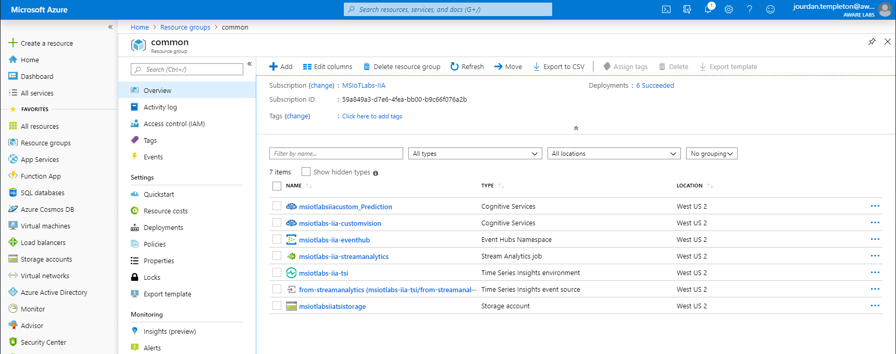

The resources here allow data to flow from all the separate lab IoT Hub instances into a single stream of IoT data which is then consumed and displayed through Time Series Insights.

### 3.1 - Cognitive Services

The Cognitive Services are a collection of pre-trained ML models that can be built into your own applications and services easily. Custom Vision is one of these services.

Custom Vision allows you to leverage the compute infrastructure in Azure to train your own Computer Vision model quickly and easily.


### 3.2 - Time Series Insights

1. Click on Time Series Insights Environment

1. 'Go To Environment' to view the user interface. The data will be displayed here. Right now you **will not**  see any data but you will return to this page to view the results of future lab exercises.


## 4 - Configure your Lab PC as an Edge Device

### 4.1 - Create Device in Azure IoT Hub

1. Open a browser and navigate to the [Azure Portal (portal.azure.com)](https://portal.azure.com). Log in with the lab credentials provided

2. Select **Resource groups** from the Azure Portal homepage.


3. Select the **msiotlabs-iia-user##** resource group in the list and choose the **IoT Hub** (this is the same IoT Hub resource that we explored earlier in step 2.1 of this lab).

4. In the IoT Hub menu under the heading **Automatic Device Management**, click **IoT Edge**\
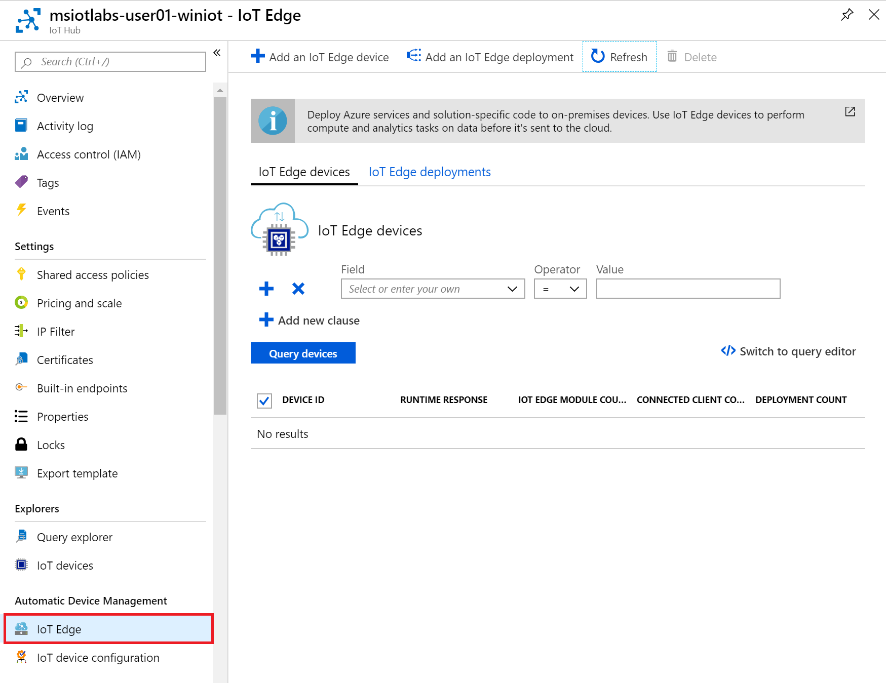

5. Click **Add an IoT Edge device** at the top of the page

6. Enter your Lab PC number printed on the device as the **Device Id**. For example #1 would convert to the **LAB.USER01**. Leave the rest of the settings as default and click **Save**
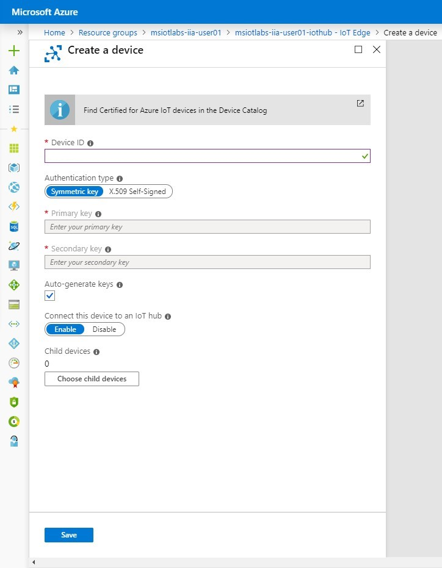

7. Click **Refresh** and your newly created device should appear in the list

8. Take note of your **Edge Device Id** (red circle) and your **IoT Hub Name** (red square). Enter them into the the **Notes** file on your desktop, you will need to refer to these variables in future steps
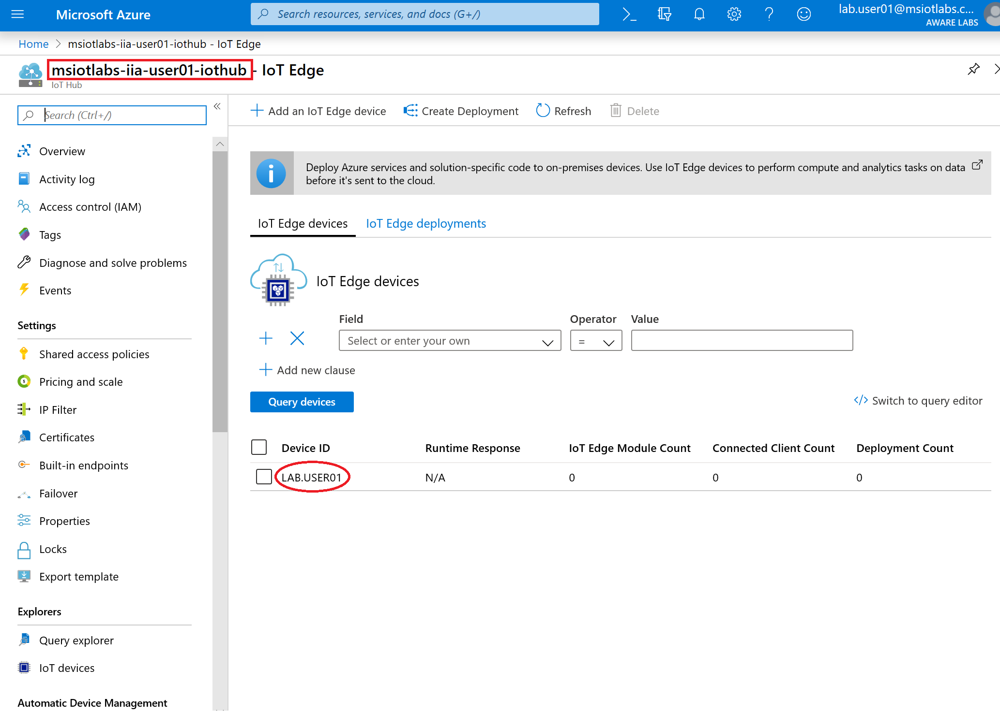

9. Select your device by clicking red circle in the picture above, then click the copy button to copy the **Primary Connection String**.  Paste this value into the **Notes** file on your desktop as we will be using it to set up the device in the next step.\
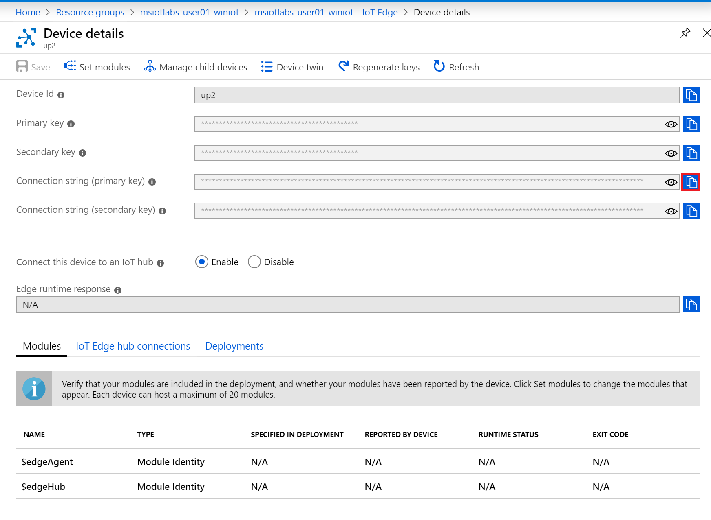

### 4.2 - IoT Device setup using Azure CLI
**Note:** This next step may cause your Lab PC to reboot, so now is a good time to save any documents that you have open.

1. On your Lab PC, open the Start Menu and type **PowerShell**, then click **Run as Administrator**\


2. Click **Yes** when it asks if you want to allow this app to make changes to your device

3. Install the Azure IoT Edge runtime on the device by running the following command:
```powershell
. {Invoke-WebRequest -useb aka.ms/iotedge-win} | Invoke-Expression; Deploy-IoTEdge
```

4. When prompted, press **Y** to install.
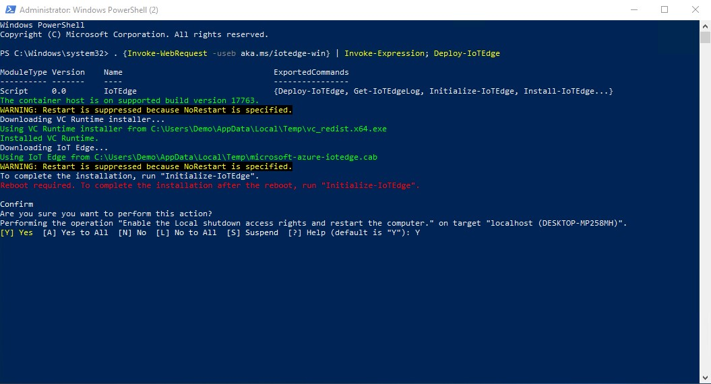

5. Configure the Azure IoT Edge runtime with the following command:
```powershell
. {Invoke-WebRequest -useb aka.ms/iotedge-win} | Invoke-Expression; Initialize-IoTEdge
```
6. When prompted, enter the Device Connection string from the previous step, including the SharedAccessKey
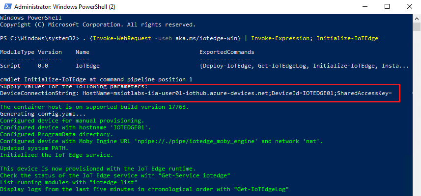

### 4.3 - Prepare your docker lab environment

1.  Open a PowerShell window **as an Administrator** (right click on the PowerShell entry and select Run as Administrator) and run the following command to use a cached version of the base containers to reduce internet bandwidth use.

```powershell
docker load -i C:\Labs\Docker\azureiotedgeagent.tar
docker load -i C:\Labs\Docker\azureiotedgehub.tar
```

### 4.4 - Verify successful installation
Run the following powershell command to check the status of the IoT Edge service, it should be listed as running:

```PowerShell
Get-Service iotedge
```
Run the following powershell command to examine service logs from the last 5 minutes. If you just finished installing the IoT Edge runtime, you may see a list of errors from the time between running Deploy-IoTEdge and Initialize-IoTEdge. These errors are expected, as the service is trying to start before being configured.

```PowerShell
. {Invoke-WebRequest -useb https://aka.ms/iotedge-win} | Invoke-Expression; Get-IoTEdgeLog
```
Run the following powershell command to run an automated check for the most common configuration and networking errors. There will be 4 yellow warnings relating to production readiness and 1 red error message relating to the Edge Hub container. The yellow warnings can be ignored within our lab environment and the red error message will resolve during the next lab when we deploy modules to our IoT Edge instance for the first time.

```PowerShell
iotedge check
```

Run the following powershell command to list running modules. After a new installation, the only module you should see running is **edgeAgent**. After you deploy IoT Edge modules for the first time, the other system module, **edgeHub**, will start on the device too.
```PowerShell
iotedge list
```
