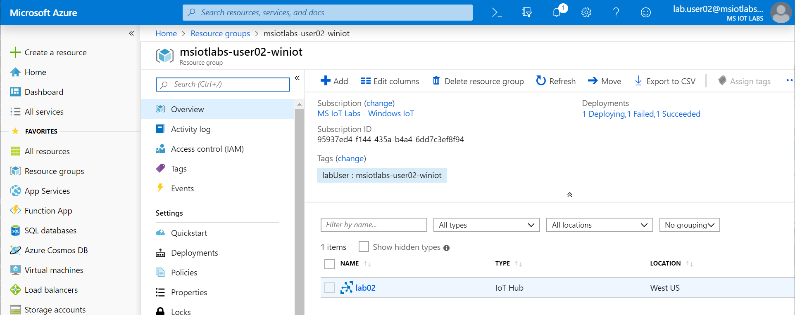

# Lab 04 - Introduction to Azure IoT Edge

This lab introduces Azure IoT Edge with Windows 10 IoT Core.

## 1.0 - Set up your Surface Laptop Device

### 1.1 - Cloud setup

1. Make a note of the Surface Laptop device name printed on the the device. For example, IOTEDGE02 
1. Open a browser and navigate to the [Azure Portal (https://portal.azure.com)](https://portal.azure.com). Login with the lab credentials provided.
1. Click **Resource groups** on the left-hand menu, select the **winiot** resource group in the list and choose the IoT Hub created in [Lab 2](./Lab02.md#11---deploy-azure-iot-hub)

1. Click **IoT Edge** on the IoT Hub side menu and click **Add an IoT Edge device** at the top. **Note: that this is a slightly different menu than the one used earlier in the lab**

1. Enter the Surface Laptop name (from step 2) as the device id and click **Save** to create the device
1. Refresh the list and open the device properties
1. Copy **Connection string (primary key)** to the clipboard


### 1.2 - Device setup
1. On your Surface LaptopOpen powershell as Administrator

2. Install the Azure IoT Edge runtime on the device by running the following command and wait for the device to reboot:

```powershell
. {Invoke-WebRequest -useb aka.ms/iotedge-win} | Invoke-Expression; Deploy-IoTEdge
```

3. Re-open the remote PowerShell session as Administrator 
4. Configure the Azure IoT Edge runtime with the following command:

```powershell
. {Invoke-WebRequest -useb aka.ms/iotedge-win} | Invoke-Expression; Initialize-IoTEdge
```
5. Enter the Device Connection string from step 1.1: 
6. To validate the Azure IoT Edge runtime installation, use the command:

```powershell
iotedge check
``` 

*You may also use this command to debug issues:*

```powershell
Get-IoTEdgeLog
```

## 2.0 - Deploy Simulated Temperature Sensor

### 2.1 - Module deployment

1. Open Powershell as Administrator:

2. Install the Azure CLI:

```powershell
Invoke-WebRequest -Uri https://aka.ms/installazurecliwindows -OutFile .\AzureCLI.msi; Start-Process msiexec.exe -Wait -ArgumentList '/I AzureCLI.msi /quiet'

```
3. Close your Powershell window and reopen it as Administrator.
4. Run the following commands replacing [devicename] and [hub name] with their respective fields:

```powershell
az extension add --name azure-cli-iot-ext

az login
az iot edge set-modules --device-id [device name] --hub-name [hub name] --content "C:\Labs\Content\src\IoTLabs.IoTEdge\deployment.example.win-x64.json"
```

### 2.2 - Monitor Device to Cloud messages

1. Enter the following command to monitor Device-to-Cloud (D2C) messages being published to the IoT Hub:

```powershell
az iot hub monitor-events -n [hub name] -d [device id]
```


## 3.0 - Configuring Azure Stream Analytics on Edge
### 3.1 - Setting up Modules
1. In the [Azure Portal (https://portal.azure.com)](https://portal.azure.com) open the **winiot** resource group
1. Open the IoT Hub resource, navigate to **IoT Edge** and select the device that was created in [step 1.1](#user-content-2---device-setup)

1. Select **Set modules**

1. Under the **Deployment Modules** heading click **+ Add** and choose **Azure Stream Analytics Module**

1. Set the Subscription as **MSIoTLabs-IIA** and Edge Job as **msiotlabs-iia-[user]-asa**, then click **Save**
*Note: You may have to click on the **Edge job** dropdown for the save button to show.*
1. When the module has loaded, select **Configure** and take note of the **Name** field. You will be using this module name in the next step.
1. Click **Save**, then **Next**

### 3.2 - Selecting the routes
1. Replace the current JSON with the following, substituting [module name] with the module name found in the previous step:

```javascript
{
    "routes": {
        "telemetryToCloud": "FROM /messages/modules/SimulatedTemperatureSensor/* INTO $upstream",
        "alertsToCloud": "FROM /messages/modules/[module name]/* INTO $upstream",
        "alertsToReset": "FROM /messages/modules/[module name]/* INTO BrokeredEndpoint(\"/modules/SimulatedTemperatureSensor/inputs/control\")",
        "telemetryToAsa": "FROM /messages/modules/SimulatedTemperatureSensor/* INTO BrokeredEndpoint(\"/modules/[module name]/inputs/temperature\")"
    }
}
```
2. Select **Next**, then **Submit**

## 4.0 - Deploy IoT Edge Modules

### 4.1 - Author a deployment.json file

Now that we have a container image with our inferencing logic stored in our container registry, it's time to create an Azure IoT Edge deployment to our device.

1. Go to **C:\Labs\Content\src\IoTLabs.IoTEdge**
1. Edit the **deployment.template.lab04.win-x64.json** file
1. Search for any variables starting with ACR and replace those values with the correct values for your container repository. The ACR_IMAGE must exactly match what you pushed, e.g. aiedgelabcr.azurecr.io/customvision:1.0-x64-winent

**Hint: you can type $containerTag to get the full container string from PowerShell.**


### 4.2 - Deploy the IoT Edge deployment.json file. 

Just like the example deployment, use the following syntax to update the expected module state on the device. IoT Edge will pick up on this configuration change and deploy the container to the device.

```powershell
az iot edge set-modules --device-id [device name] --hub-name [hub name] --content "C:\Labs\Content\src\IoTLabs.IoTEdge\deployment.template.lab04.win-x64.json"
```

Run the following command to get information about the modules deployed to your IoT Hub.
```powershell
az iot hub module-identity list --device-id [device name] --hub-name [hub name]
```

### 4.3 - Verify the deployment on IoT device

The module deployment is instant, however changes to the device can take around 5-7 minutes to take effect. On the **target device** you can inspect the running modules with the following command in the remote PowerShell terminal:

```powershell
iotedge list
```

Once the modules have deployed to your device, you can inspect that the module is operating correctly:

```powershell
iotedge logs [container-name]
```

### 4.4 - Monitor Device to Cloud messages

1. Open Powershell as Administrator
1. Enter the following command to monitor Device-to-Cloud (D2C) messages being published to the IoT Hub, you should see temperature events start to come through.

```powershell
az iot hub monitor-events -n [hub name] -d [device id]
```
