# Lab 4 – Processing Data at the edge with Azure Stream Analytics

This lab introduces Azure Stream Analytics with Azure IoT Edge on Windows 10 IoT Enterprise.

## 1 - Deploy Simulated Temperature Sensor

### 1.0 - Prepare your docker lab environment

1.  Open a PowerShell window **as an Administrator** (right click on the PowerShell entry and select Run as Administrator) and run the following command to use a cached version of the base container to reduce internet bandwidth use.

```powershell
docker load -i C:\Labs\Docker\temperaturesimulator.tar
```

### 1.1 - Module deployment using Azure CLI

1. Open the Start Menu and type **PowerShell**, then click **Run as Administrator**

2. Login to Azure CLI using the following command:

**Note:** You may be asked to login to your browser; use your lab credentials
```powershell
az extension add --name azure-cli-iot-ext
az login
```
3. Set your account to the correct subscription:
```powershell
az account set --subscription 'MSIoTLabs-IIA'
```
4. Run the following command replacing **[Edge Device id]** and **[IoT Hub Name]** with their respective fields from the **notes** file on your desktop (also found in the IoT Hub set up in Lab 3):
```powershell
az iot edge set-modules --device-id [Edge device id] --hub-name [IoT Hub Name] --content "C:\Labs\Content\src\IoTLabs.IoTEdge\deployment.template.lab04.win-x64.json"

#NOTE - entries are case sensitive and must be exactly the same as in the Azure port. Also make sure to remove the square brackets above, for example:
#az iot edge set-modules --device-id labuser01 --hub-name msiotlabs-iia-user01-iothub --content "C:\Labs\Content\src\IoTLabs.IoTEdge\deployment.template.lab04.win-x64.json"
```

### 1.2 - Verify Deployment on IoT Edge Device
The module deployment is instant, however, changes to the device can take around 5-7 minutes to take effect. This means it can take a while for the new container to be loaded. The following commands can be used to check the status of the SimulatedTemperatureSensor container:

1. Run the following PowerShell command to view the current modules. You should see 3 modules in total once the modules have been deployed to the device.
```powershell
iotedge list
```

1. Next run validation of the Azure IoT Edge runtime installation to ensure there are no errors. Note that there will still be warnings that can be safely ignored. Continue within PowerShell and use the command:
```powershell
iotedge check
``` 

1. Try running the following to see the logs from our simulated temperature sensor:
```powershell
iotedge logs SimulatedTemperatureSensor
```

Your device should be receiving simulated temperature data every 5 seconds with the machine temperature steadily rising.

### 1.3 - Monitor Device-to-Cloud messages
1. Enter the following command to monitor Device-to-Cloud (D2C) messages being published to the IoT Hub replacing **[Edge Device Id]** and **[IoT Hub Name]** with their respective fields from the **notes** file on your desktop:
```powershell
az iot hub monitor-events --device-id [Edge Device Id] --hub-name  [IoT Hub Name]

#NOTE - make sure to remove the square brackets above, for example:
#az iot hub monitor-events --device-id device1 --hub-name  msiotlabs-iia-user06-iothub
```
2. The first time that you run this command, you are required to update a dependency by pressing **Y** then **enter**

This command will monitor the data being published into IoT Hub from the SimulatedTemperatureSensor container. It may take a while for data to start showing.

**Note:** Use Ctrl-C to stop monitoring as we will be doing more PowerShell commands soon.

## 2 - Configure Azure Stream Analytics Edge Job

### 2.0 - Prepare your docker lab environment

1.  Open a PowerShell window **as an Administrator** (right click on the PowerShell entry and select Run as Administrator) and run the following command to use a cached version of the base container to reduce internet bandwidth use.

```powershell
docker load -i C:\Labs\Docker\streamanalytics.tar
```

### 2.1 - Navigate to your Azure Stream Analytics Edge Job
1. In the [Azure Portal (https://portal.azure.com)](https://portal.azure.com) open the **msiotlabs-iia-user##** resource group

2. Open the **Stream Analytics job** resource
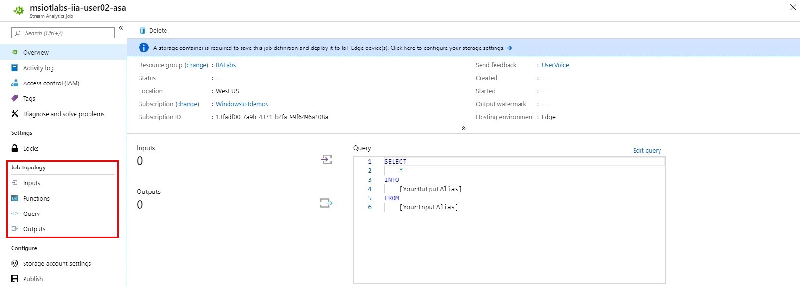

### 2.2 - Adding Inputs

1. Under the **Job topology** heading in the stream analytics menu, select **Inputs**

2. Select **Add stream input**, then select **Edge Hub**

3. Set the **Input Alias** as **temperature** and leave the rest of the settings as default.

4. Click **Save**

### 2.3 - Adding Outputs

1. Under the **Job topology** heading in the left-hand menu, select **Outputs**

2. Select **Add**, then select **Edge Hub**

3. Set the **Output Alias** as **alert** and leave the rest of the settings as default.

4. Click **Save**

### 2.4 - Adding Query

1. Under the **Job topology** heading in the left-hand menu, select **Query**

2. Replace the existing Select statement with the one below:
```sql
SELECT  
    'reset' AS command,
    'lab04' AS source
INTO 
   alert 
FROM 
   temperature TIMESTAMP BY timeCreated 
GROUP BY TumblingWindow(second, 30) 
HAVING Avg(machine.temperature) > 26
```
Stream Analytics can be used to enable complex logic on streams of data. This query is enabling our device to send a '**reset**' message when the average temperature exceeds 26 degrees over 30 seconds.

3. Click **Save query**


## 3 - Configure IoT Edge to use Azure Stream Analytics Edge Job

### 3.1 - Module deployment using Azure Portal

1. In the [Azure Portal (https://portal.azure.com)](https://portal.azure.com) open the **msiotlabs-iia-user##** resource group

2. Open the **IoT Hub** resource, navigate to **IoT Edge** and then select the device created in Lab 3
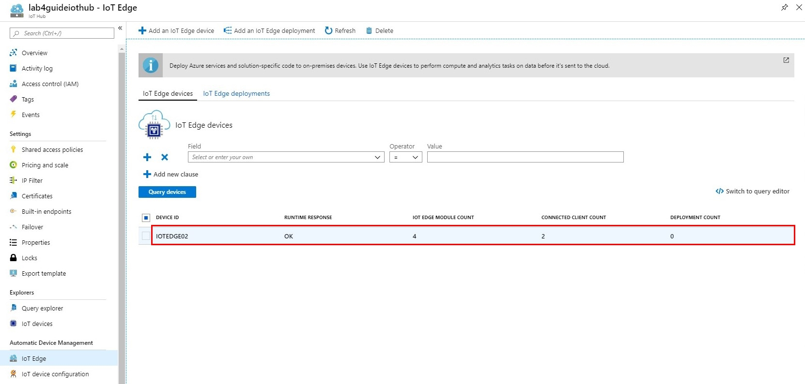

3. Click **Set modules**\
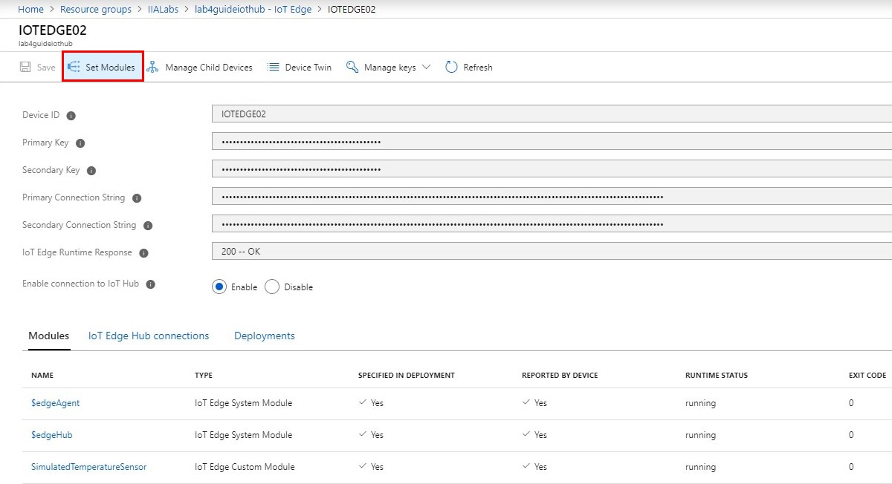

4. Under the **Deployment Modules** heading click **+ Add** and choose **Azure Stream Analytics Module**


5. Set the Subscription as **MSIoTLabs-IIA** and Edge Job as **msiotlabs-iia-user##-streamanalytics**, then click **Save**

**Note:** You may have to click on the **Edge job** dropdown for the save button to show.

6. When the module has loaded, take note of the **Name** field as **module name** with the **notes** file on your desktop. You will be using this module name in the next step
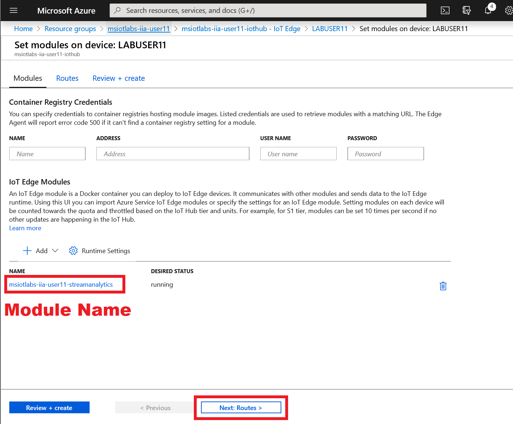

7. Click **Next:Routes**

### 3.2 - Adding the routes
  
1. Remove the existing routes and edit the routing table to look like the image below by copying the fields in the following table and substituting **[module name]** with the module name found in the **notes** file on your desktop. There are 3 places that **[module name]** needs to be changed:


|Name     |Value  |
|---------|---------|
|telemetryToCloud     | FROM /messages/modules/SimulatedTemperatureSensor/* INTO $upstream        |
|alertsToCloud     | FROM /messages/modules/**[module name]**/* INTO $upstream        |
|alertsToReset     |FROM /messages/modules/**[module name]**/* INTO BrokeredEndpoint("/modules/SimulatedTemperatureSensor/inputs/control")         |
|telemetryToAsa     | FROM /messages/modules/SimulatedTemperatureSensor/* INTO BrokeredEndpoint("/modules/**[module name]**/inputs/temperature")        |

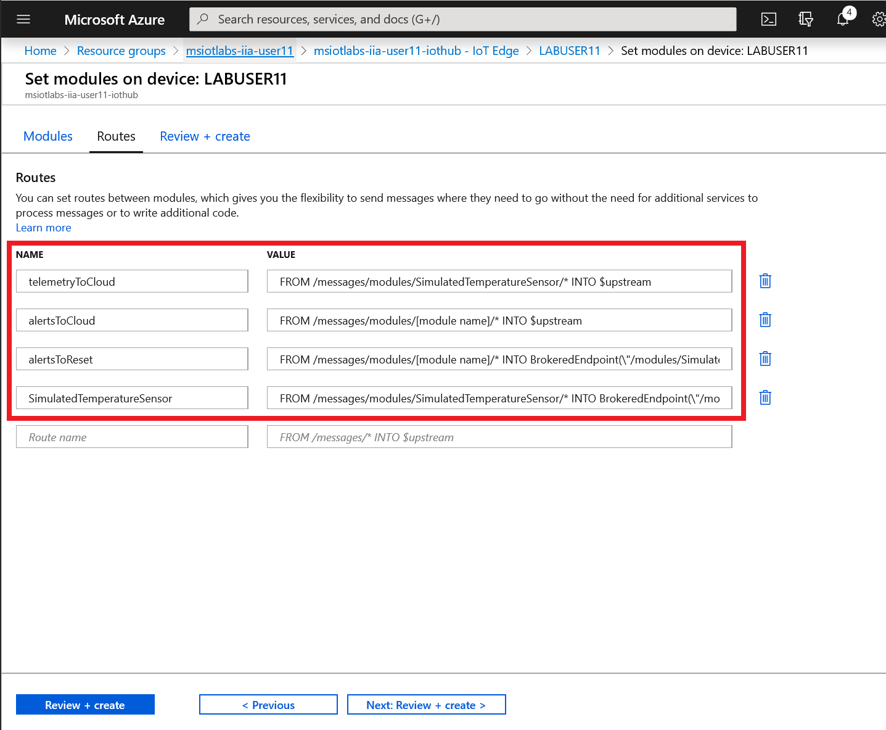

2. Select **Next:Review + create**, then **Create**

### 3.3 - Verify Deployment on IoT Edge Device
The module deployment is instant, however, changes to the device can take around 5-7 minutes to take effect. Let's check that our device has loaded our Azure Stream Analytics module from the last step.

1. Open the Start Menu and type **PowerShell**, then click **Run as Administrator**

2. Inspect the currently running modules using the following command:
```powershell
iotedge list
```
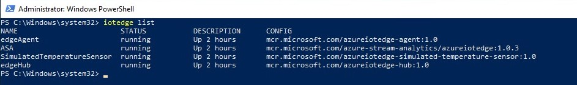

3. Try running the following to see the logs from our simulated temperature sensor:
```powershell
iotedge logs -f --tail 5 SimulatedTemperatureSensor
```
**Note:** Use Ctrl-C to stop monitoring as we will be doing more PowerShell commands soon.

You should see that the machine temperature increases until it reaches a temperature higher than the 26 degree threshold for at least 30 seconds.
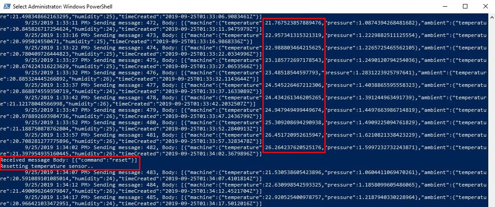

4. When the SimulatedTemperatureSensor container stops producing data you can reset it to start over:
```powershell
iotedge restart SimulatedTemperatureSensor
```

### 3.4 - Enable IoT Hub Routes

1. Return to your IoT Hub settings in the Azure Portal.

2. Click on **Message Routing**

3. Choose the existing route named **SendTelemetryToEventHub** and click **Enable Route**

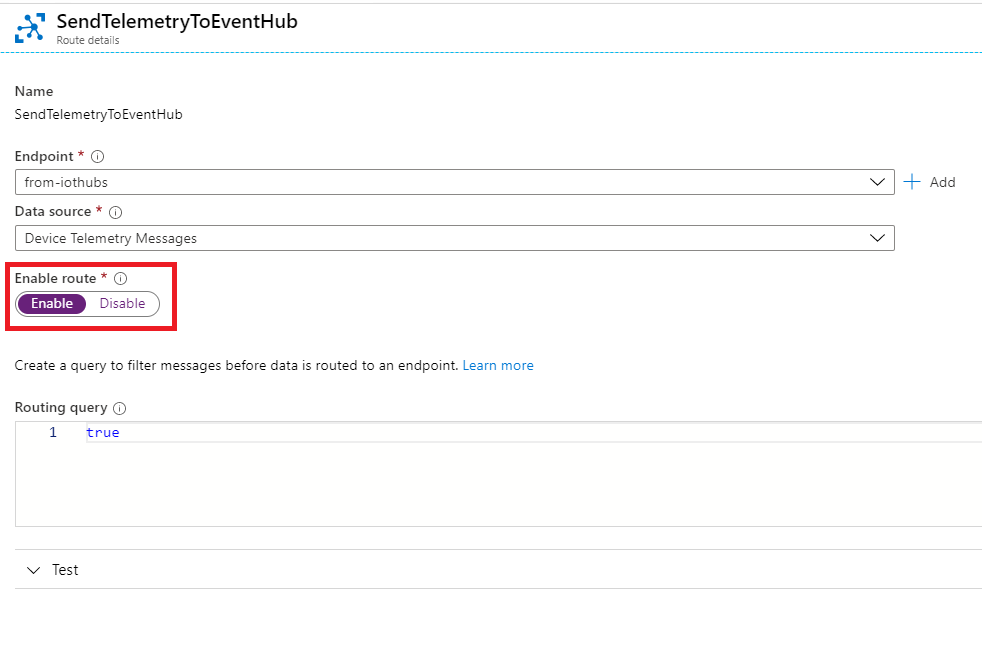

4. Save changes


This step will enable telemetry to flow into Time Series Insights which you can view from the common Resource Group.

## 4 - Azure Time Series Insights (TSI)

### 4.1 - Visualise your data with Time Series Insights

These labs demonstrate how to collect, process and consolidate data from many different streaming sources into a single data platform. Azure Time Series Insights (TSI) allows mass collection and visualisation of time series data.

1. Open the Azure Portal and navigate to the **common** Resource Group
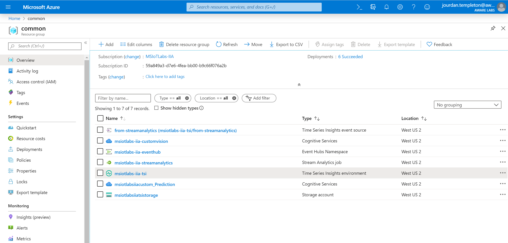

2. Click on the **msiotlabs-iia-tsi** resource to view the TSI details
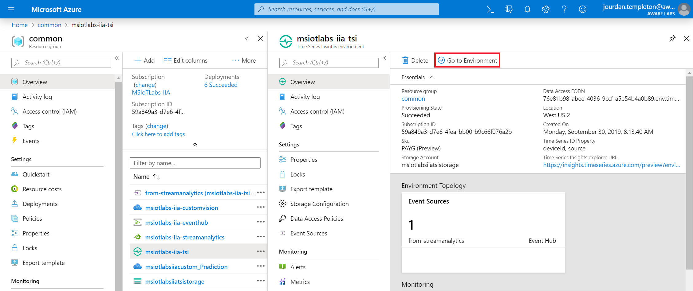

3. Click **Go to environment** to navigate to the TSI dashboard

4. On the left column, look for your lab username and lab number. For example, "**LAB.USER30 LAB04**", click this device and choose **Show temperature**\
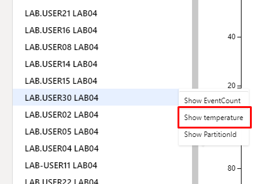

### 4.2 - Selecting a Timeframe
**Using the Time Selection Panel**

1. At the top of the screen, you will see a bar that represents the currently selected timeframe 
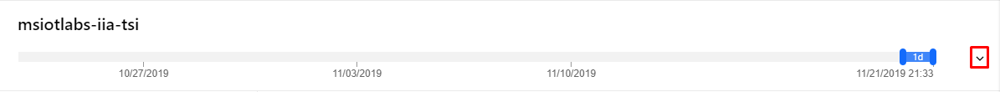

2. You can expand it using the little down arrow on the right
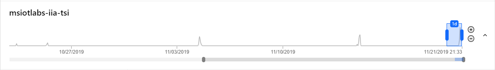

3. Try changing the timeframe by dragging/moving the blue box across the timeline:
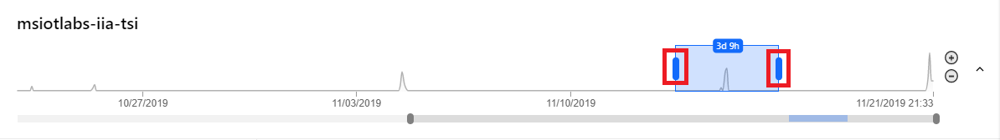

4. The peaks on the timeline show times that data was received by TSI

**Using the Timeframe selector**

1. In the top right corner of TSI click the **calendar icon** next to the word **Timeframe**\
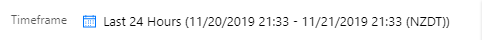

2. We can use this menu to choose a fixed timeframe:\
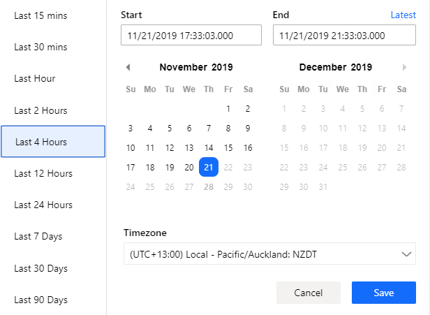

3. Try selecting **Last 4 hours** to see the data from today's lab

### 4.2 - Compare multiple sources

1. On the left column, select another lab users device and choose **Show temperature**

2. If that user had data coming through to TSI, you should see 2 charts. Keep trying users until you find one with data.
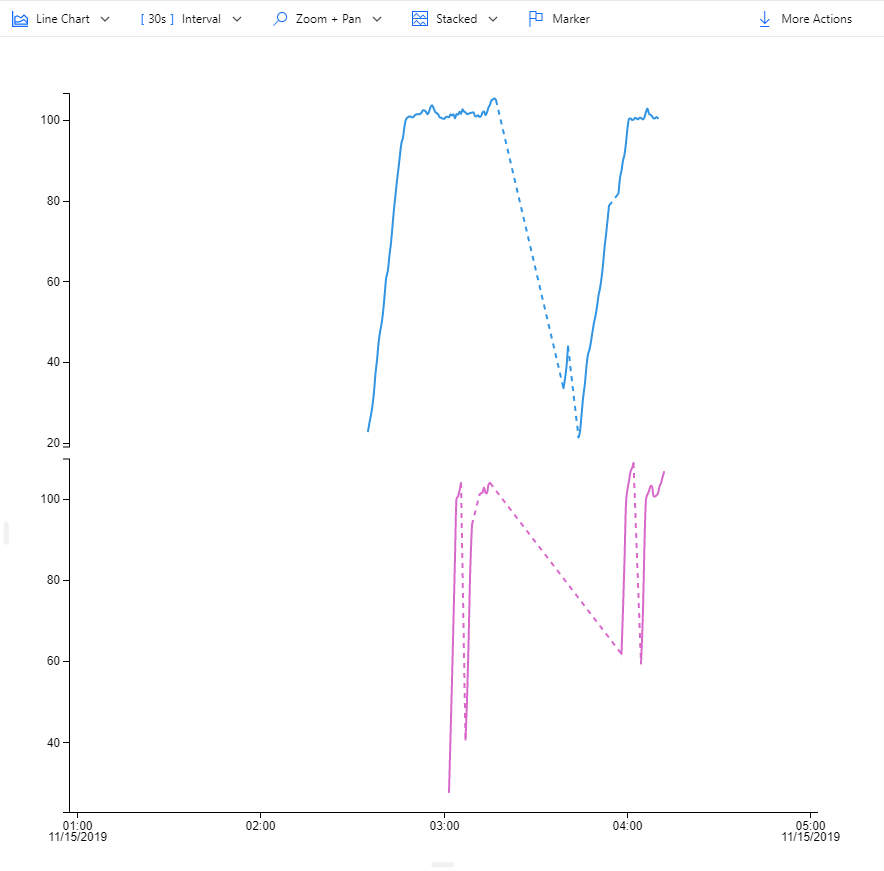

3. Each source you add can be seen at the bottom of the screen:\
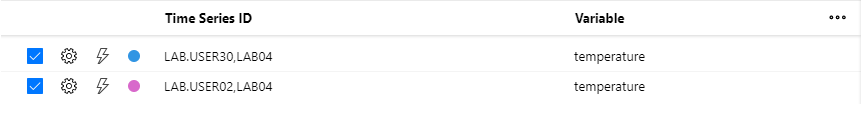

4. Use the options in the **Zoom + Pan** menu until you get to a zoom that makes sense

5. Try clicking on **Stacked** and change it to **Shared** or **Overlap** to see the graphs overlaid on the same axis 

6. Try clicking on **Interval** and see how the TSI aggregates your data over the specified interval
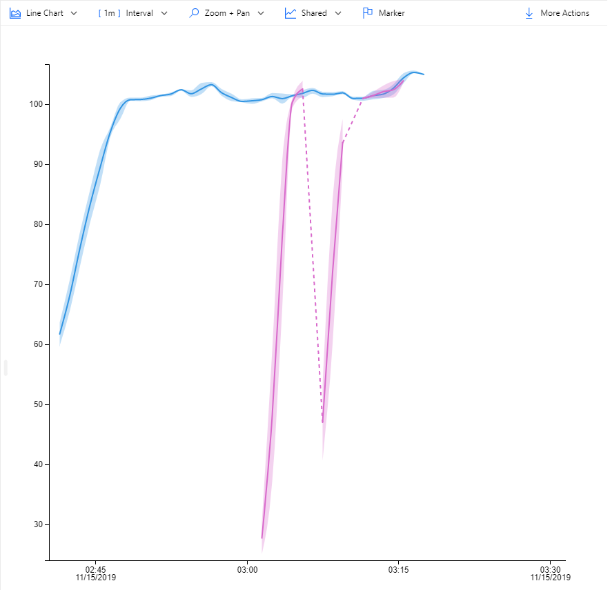

7. Use the **Marker** button to compare the data for all selected sources at a specific time
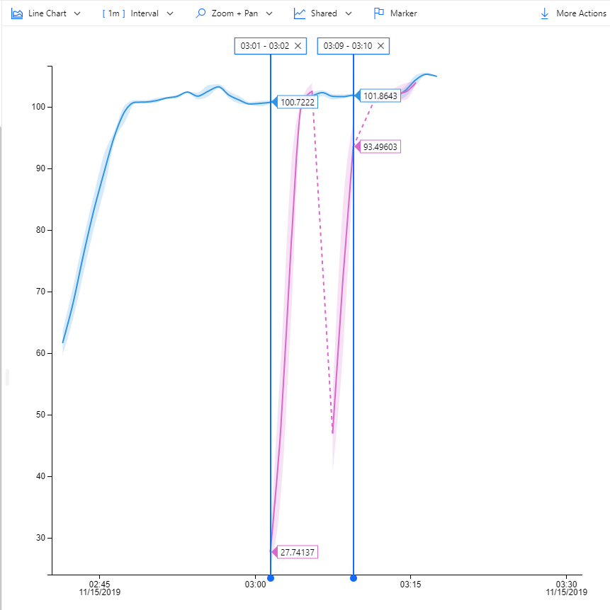

### 4.3 - Exploring Events

1. Click and drag your mouse on the graph to select an area that you are intersted in, then click **Explore Events**
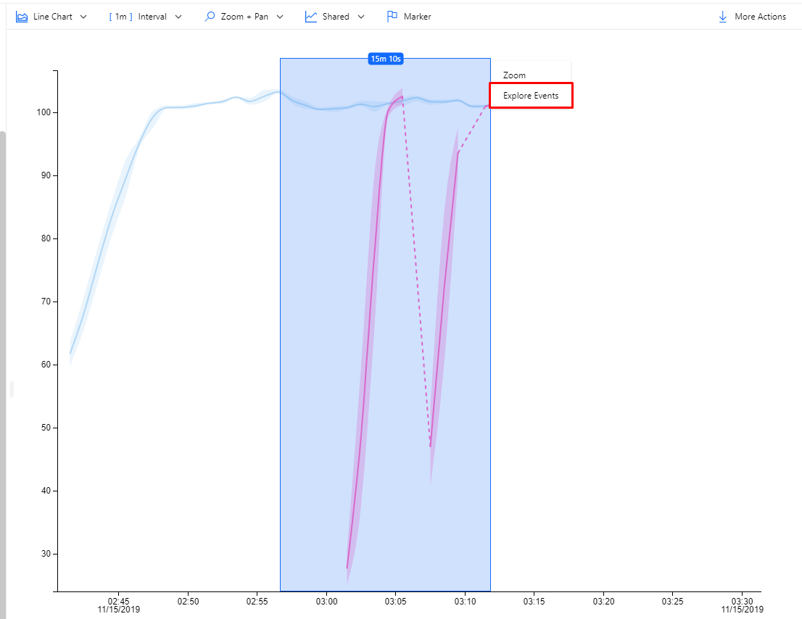

2. Here you can see the individual events that made up portion that you selected. You can even export the data as a CSV file for further processing.
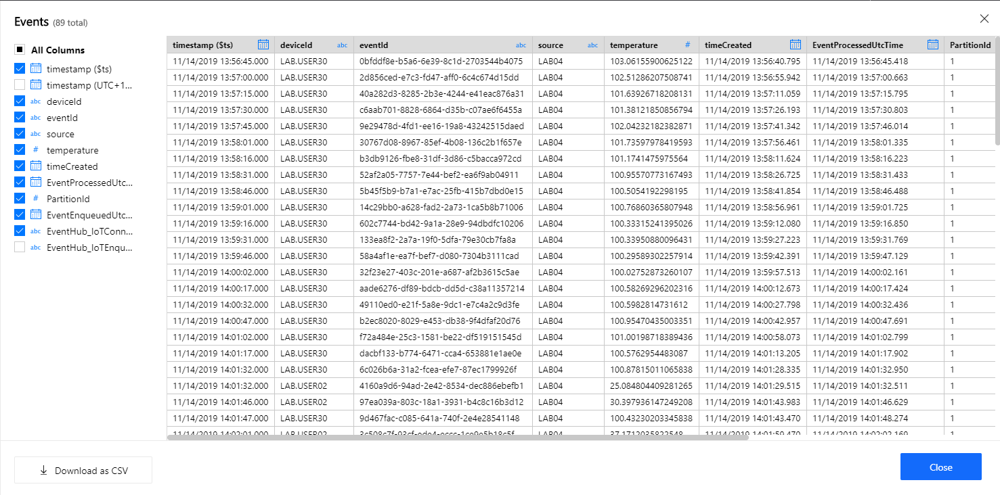
