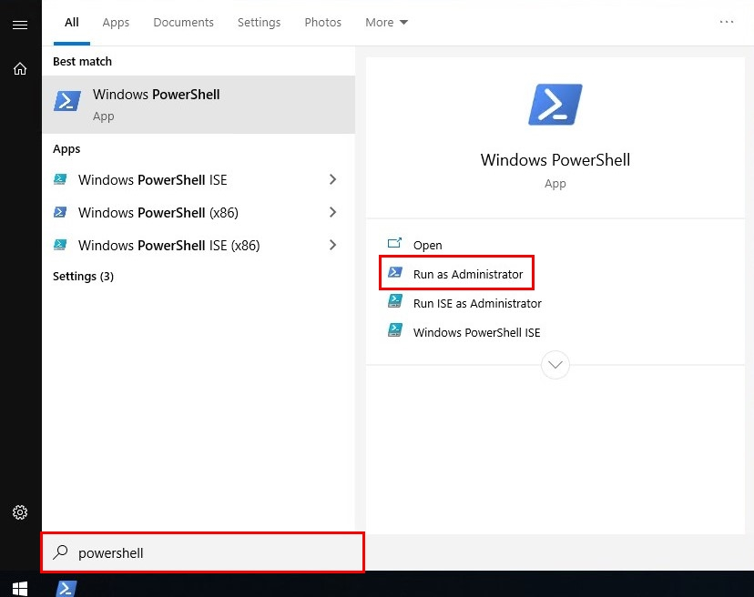
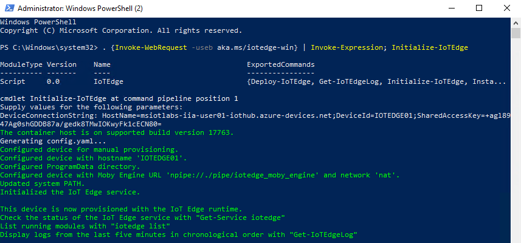
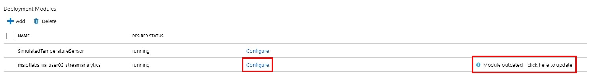
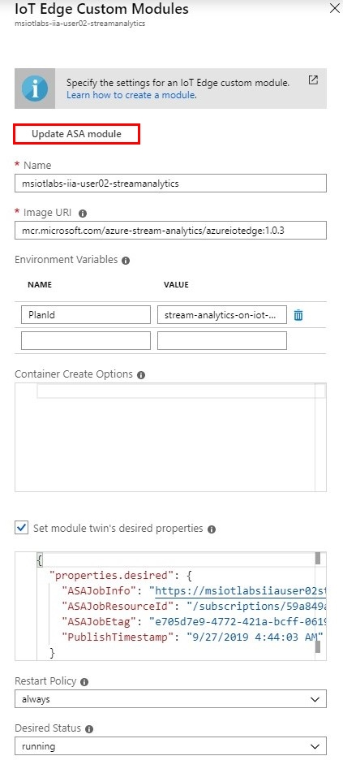

# Lab 04 - Introduction to Azure Stream Analytics with Azure IoT Edge

This lab introduces Azure Stream Analytics with Azure IoT Edge on Windows 10 IoT Enterprise.

## 1 - Set up your Surface Laptop Device

### 1.1 - Cloud setup

1. Make a note of the Surface Laptop device name printed on the device. For example, lab.user##@msiotlabs.com
2. Open a browser and navigate to the [Azure Portal (portal.azure.com)](https://portal.azure.com). Log in with the lab credentials provided
3. Click **Resource groups**, select the **msiotlabs-iia-user##** resource group in the list and choose the **IoT Hub** created in [Lab 3](./Lab03.md#10---provision-azure-resources)
4. In the left hand menu under the heading **Automatic Device Management**, click **IoT Edge**\

5. Click **Add an IoT Edge device** at the top of the page
6. Enter the Surface Laptop name (from earlier) as the device id, leave the rest of the settings as default and click **Save**

7. Click **Refresh** and your newly created device should appear in the list
8. Select your device and take note of the **Primary Connection String**. We will be using it in the next step, so keep this page ready or save the into a document on your desktop for ease\


### 1.2 - IoT Device setup using Azure CLI
**Note:** Now is a good time to Save any documents that you have been updating on your Surface Laptop device, as the next steps will cause a reboot.

1. On your Surface Laptop device, open the Start Menu and type **PowerShell**, then click **Run as Administrator**\

2. Install the Azure IoT Edge runtime on the device by running the following command (click 'Yes' when it asks if you want to allow this app to make changes to your device) and waiting for the device to reboot:
```powershell
. {Invoke-WebRequest -useb aka.ms/iotedge-win} | Invoke-Expression; Deploy-IoTEdge
```


3. When prompted, press **Y** two times, including one to reboot
4. When the system has booted again, re-open the PowerShell session as Administrator 
5. Configure the Azure IoT Edge runtime with the following command:
```powershell
. {Invoke-WebRequest -useb aka.ms/iotedge-win} | Invoke-Expression; Initialize-IoTEdge
```


6. Enter the Device Connection string from the previous step, including the SharedAccessKey. 
7. To validate the Azure IoT Edge runtime installation, continue within PowerShell and use the command:
```powershell
iotedge check
``` 


## 2 - Deploy Simulated Temperature Sensor

### 2.1 - Module deployment using Azure CLI

1. Open the Start Menu and type **PowerShell**, then click **Run as Administrator**\
2. Login to Azure CLI using the following command:

**Note:** You may be asked to login to your browser; use your lab credentials
```powershell
az extension add --name azure-cli-iot-ext
az login
```
3. Set your account to the correct subscription:
```powershell
az account set --subscription 'MSIoTLabs-IIA'
```
4. Run the following command replacing **[device id]** and **[hub name]** with their respective fields:
```powershell
az iot edge set-modules --device-id [device id] --hub-name [hub name] --content "C:\Labs\Content\src\IoTLabs.IoTEdge\deployment.example.win-x64.json"

#NOTE - make sure to remove the square brackets above, for example:
#az iot edge set-modules --device-id device1 --hub-name msiotlabs-iia-user06-iothub --content "C:\Labs\Content\src\IoTLabs.IoTEdge\deployment.example.win-x64.json"
```

### 2.2 - Verify Deployment on IoT Edge Device
The module deployment is instant, however changes to the device can take around 5-7 minutes to take effect. This means it can take a while for the new container to be loaded. The following commands can be used to check the status of the SimulatedTemperatureSensor container:

1. Run the following PowerShell command to see the current modules:
```powershell
iotedge list
```

2. Try running the following to see the logs from our simulated temperature sensor:
```powershell
iotedge logs SimulatedTemperatureSensor
```

Your device should be receiving simulated temperature data every 5 seconds with the machine temperature steadily rising.

### 2.3 - Monitor Device-to-Cloud messages
1. Enter the following command to monitor Device-to-Cloud (D2C) messages being published to the IoT Hub:
```powershell
az iot hub monitor-events --device-id [device id] --hub-name  [hub name]

#NOTE - make sure to remove the square brackets above, for example:
#az iot hub monitor-events --device-id device1 --hub-name  msiotlabs-iia-user06-iothub
```
2. The first time that you run this command, you are required to update a dependency by pressing **Y** then **enter**

This command will monitor the data being published into IoT Hub from the SimulatedTemperatureSensor container. It may take a while for data to start showing.

**Note:** Use Ctrl-C to stop monitoring as we will be doing more PowerShell commands soon.

## 3 - Configure Azure Stream Analytics Edge Job

### 3.1 - Navigate to your Azure Stream Analytics Edge Job
1. In the [Azure Portal (https://portal.azure.com)](https://portal.azure.com) open the **msiotlabs-iia-user##** resource group
2. Open the **Stream Analytics job** resource


### 3.2 - Adding Inputs
1. Under the **Job topology** heading in the left hand menu, select **Inputs**
2. Select **Add stream input**, then select **Edge Hub**
3. Set the **Input Alias** as **temperature** and leave the rest of the settings as default.
4. Click **Save**

### 3.3 - Adding Outputs
1. Under the **Job topology** heading in the left hand menu, select **Outputs**
2. Select **Add**, then select **Edge Hub**
3. Set the **Output Alias** as **alert** and leave the rest of the settings as default.
4. Click **Save**

### 3.4 - Adding Query
1. Under the **Job topology** heading in the left hand menu, select **Query**
2. Replace the existing Select statement with the one below:
```sql
SELECT  
    'reset' AS command,
    'lab04' AS source
INTO 
   alert 
FROM 
   temperature TIMESTAMP BY timeCreated 
GROUP BY TumblingWindow(second,30) 
HAVING Avg(machine.temperature) > 24
```

Stream Analytics can be used to enable complex logic on streams of data. This query is enabling our device to send a 'reset' message when the average temperature exceeds 24 degrees over 30 seconds.


3. Click **Save query**


## 4 - Configure IoT Edge to use Azure Stream Analytics Edge Job

### 4.1 - Module deployment using Azure Portal
1. In the [Azure Portal (https://portal.azure.com)](https://portal.azure.com) open the **msiotlabs-iia-user##** resource group
2. Open the **IoT Hub** resource, navigate to **IoT Edge** and then select the device created in [step 1.1](#11---cloud-setup)

3. Click **Set modules**

4. Under the **Deployment Modules** heading click **+ Add** and choose **Azure Stream Analytics Module**

5. Set the Subscription as **MSIoTLabs-IIA** and Edge Job as **msiotlabs-iia-user##-streamanalytics**, then click **Save**

**Note:** You may have to click on the **Edge job** dropdown for the save button to show.

6. When the module has loaded, select **Configure** and take note of the **Name** field. You will be using this module name in the next step.
7. Click **Save**, then **Next**

### 4.2 - Selecting the routes
1. Replace the current JSON with the following, substituting **[module name]** with the module name found in the previous step. There are 3 places that **[module name]** needs to be changed:

```javascript
{
    "routes": {
        "telemetryToCloud": "FROM /messages/modules/SimulatedTemperatureSensor/* INTO $upstream",
        "alertsToCloud": "FROM /messages/modules/[module name]/* INTO $upstream",
        "alertsToReset": "FROM /messages/modules/[module name]/* INTO BrokeredEndpoint(\"/modules/SimulatedTemperatureSensor/inputs/control\")",
        "telemetryToAsa": "FROM /messages/modules/SimulatedTemperatureSensor/* INTO BrokeredEndpoint(\"/modules/[module name]/inputs/temperature\")"
    }
}
```
2. Select **Next**, then **Submit**

### 4.3 - Verify Deployment on IoT Edge Device
The module deployment is instant, however changes to the device can take around 5-7 minutes to take effect. Let's check that our device has loaded our Azure Stream Analytics module from the last step.

1. Open the Start Menu and type **PowerShell**, then click **Run as Administrator**\
2. Inspect the currently running modules using the following command:
```powershell
iotedge list
```


3. Try running the following to see the logs from our simulated temperature sensor:
```powershell
iotedge logs SimulatedTemperatureSensor
```
You should see that the machine temperature increases until it reaches a temperature higher than the 24 degree threshold for at least 30 seconds.


## 5 - Updating Existing IoT Edge Device Modules
### 5.1 - Update Module Twin
1. In the [Azure Portal (https://portal.azure.com)](https://portal.azure.com) open the **msiotlabs-iia-user##** resource group
2. Open the **IoT Hub** resource, navigate to **IoT Edge** and then select the device created in [step 1.1](#11---cloud-setup)
3. Click **Set modules**
4. Click **Configure** next to the **SimulatedTemperatureSensor** module
5. Update **SendInterval** from **5** to a new value of  **1**
6. Click **Save**, then click **Next**, then click **Next**
7. Leave the routes as they are and click **Next**
8. Click **Submit**
9. Run through step 4.3 again to verify that the SimulatedTemperatureSensor module is now reporting every second instead of every 5 seconds

### 5.2 - Update Stream Analytics Edge Job
1. In the [Azure Portal (https://portal.azure.com)](https://portal.azure.com) open the **msiotlabs-iia-user##** resource group
2. Open the **Stream Analytics job** resource
3. Under the **Job topology** heading in the left hand menu, select **Query**
4. Replace by editing the current query with the following:
```sql
SELECT
    AVG(machine.temperature) AS temperature,
    MAX(timeCreated) AS timeCreated,
    'lab04' AS source 
INTO 
   alert
FROM
     temperature TIMESTAMP BY timeCreated 
GROUP BY TumblingWindow(second,15) 
```

5. Click **Save query**

### 5.3 - Push the Updated Module
1. In the [Azure Portal (https://portal.azure.com)](https://portal.azure.com) open the **msiotlabs-iia-user##** resource group
2. Open the **IoT Hub** resource, navigate to **IoT Edge** and then select the device created in [step 1.1](#11---cloud-setup)
3. Click **Set modules**
4. You will notice that the **Stream Analytics** module has a warning saying: "Module outdated - click here to update"

5. Click **Configure** next to the **Stream Analytics** module
6. Take a copy of the Name to be used in the next step. Click the **Update ASA module**, then click **Save** and finally **Next**.

7. Replace the current JSON with the following, substituting **[module name]** with the module name found in the previous step (replaced in two places):
```javascript
{
  "routes": {
    "AsaToIotHub": "FROM /messages/modules/[module name]/* INTO $upstream",
    "telemetryToAsa": "FROM /messages/modules/SimulatedTemperatureSensor/* INTO BrokeredEndpoint(\"/modules/[module name]/inputs/temperature\")"
  }
}
```
8. Click **Next**, then **Submit**


### 5.4 - Enable IoT Hub Routes

1. Return to your IoT Hub settings in the Azure Portal.
2. Click on 'Message Routing'
3. Choose the existing route and click 'Enable'
4. Save changes

This step will enable telemetry to flow into Time Series Insights which you can view from the common Resource Group.
