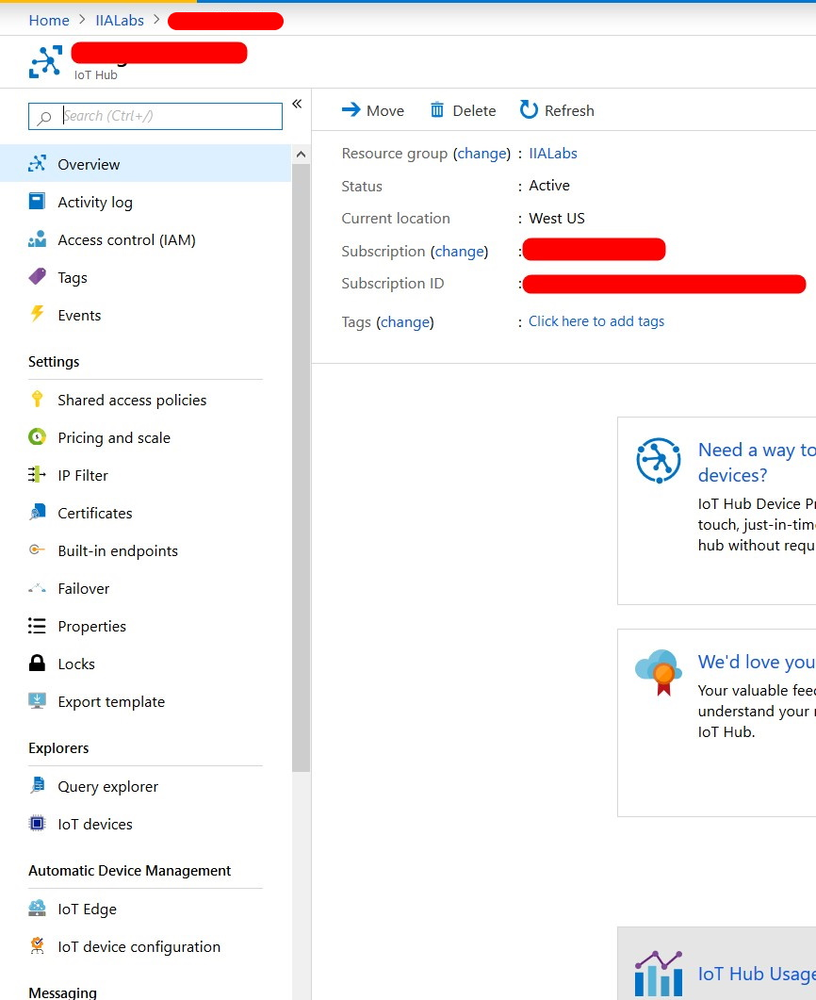
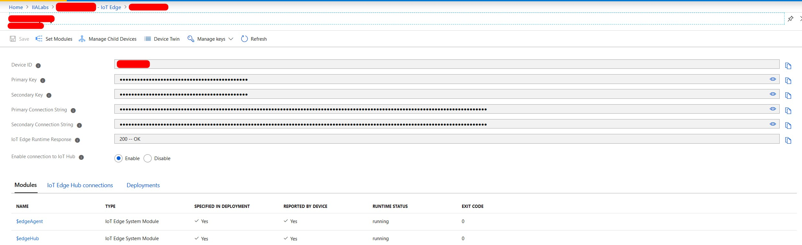

# Lab 05 - Machine Learning at the Edge


For this lab, we will use the Azure Custom Vision service to train a machine learning model for image classification. We will use that model to create a .NET Core application to pull frames from the camera attached to your lab PC. It will then use Windows ML to classify the image, then send the result to Azure IoT Hub. We will deploy that application to a Azure IoT Edge container and deploy back to your Lab PC using Azure IoT Edge. Finally, we will visualize the results using Time Series Insights.

## Ready to go

When starting the lab, you should have these things open on your development machine:
1. These instructions.
1. Visual Studio Code.
1. [Custom Vision Portal](https://www.customvision.ai/) open in a browser tab, logged in.  
1. [Time Series Insights explorer](https://insights.timeseries.azure.com/) in another browser tab, also logged in.

## 1 - Custom Vision

### 1.1 - Capture training images

1. Using the Camera app on your development PC, take at least 5 pictures each of your objects. 
    * Store these pictures on your computer. 
    * Organize all the photos for each object into a folder named for this object - this will make them easier to upload.
    
### 1.2 - Create a Custom Vision Image Classification project

1. Log into the [Custom Vision Portal](https://www.customvision.ai/).
1. Create a New Project. 
1. Configure your project as follows:

    | Field | Value |
    | --- | --- |
    | Name | Enter a unique name |
    | Description | Leave blank |
    | Resource | Select the existing item in the list  |
    | Project Types | Classification |
    | Classification Types | Multiclass (Single tag per image) |
    | Domains | General **(compact)** |
    |Export Capabilities|Basic platforms|

    **Note:** If you can't see the Export Capabilities, make sure that the Domain is set to General (compact).
   
    
1. Verify that all the details you have entered are correct.
   
1. Click Create project.

### 1.3 - Upload and tag training data

1. Click the Add image button and bulk upload your images based on the object type.
    * Upload all of object1 first and add the object1 tag, then all of object2 and add the object2 tag etc.
    * Each time you upload all the images for a given object, specify the tag at that time.
 1. Example of bulk uploading and tagging images.
   
    
### 1.4 - Train your model

1. Click on the Training button (green one in the top right).
1. Select the Quick Training option.
1. Click Train.
4. Example of training your model.
   

### 1.5 - Test your model

1. Select "Quick Test" to test the model.
1. Using the camera app on your PC, take one more picture of one of the objects
1. Upload the picture you took, verify that it was predicted correctly.

### 1.6 - Export your model

1. Switch to the Performance tab in the portal.
1. Click on Export.
1. Select ONNX for the type.
1. Select ONNX1.2 for the version.
1. Click Export.
   
1. After Custom Vision has prepared the Export, click Download.
1. Extract the downloaded zip file and rename `model.onnx` to `CustomVision.onnx`.


## 2 - Package the model into a C# .NET Application

### 2.1 - Get your model file

1. Copy the CustomVision.onnx model file from your downloads directory into the lab directory "C:\Labs\Content\src\IoTLabs.CustomVision", overwrite the existing onnx file.

### 2.2 - Build & Test the sample

1. Open a Command Prompt window and enter the following:

```
cd C:\Labs\Content\src\IoTLabs.CustomVision
dotnet restore -r win-x64
dotnet publish -c Release -o ./release -r win-x64 --self-contained true
```

2. Hold you objects up in front of the camera, still connected to your development PC.

Run the sample locally to classify the object. This will test that the app is running correctly locally. We specify "Front" for this model of camera. Here we can see that a "Mug" has been recognized.

**Note:** You must close the camera app if it is open
```
dotnet run --model=CustomVision.onnx --device=Front

4/24/2019 4:09:04 PM: Loading modelfile 'CustomVision.onnx' on the CPU...
4/24/2019 4:09:04 PM: ...OK 594 ticks
4/24/2019 4:09:05 PM: Running the model...
4/24/2019 4:09:05 PM: ...OK 47 ticks
4/24/2019 4:09:05 PM: Recognized {"results":[{"label":"Mug","confidence":1.0}],"metrics":{"evaltimeinms":47,"cycletimeinms":0}}
```

## Step 3 : Build and push a container

### 3.0 - Containerize the sample app

The following steps assume that you have created a Azure Container Registry in Lab 3.

1. Ensure that docker is running or that it is in your PATH variables.
    * If you are using Docker Desktop then ensure it is running in Windows mode.
2.  Open a PowerShell window **as Administrator** and run the following commands:

```powershell
cd C:\Labs\Content\src\IoTLabs.CustomVision\release

#this command sets the default docker host to the IoT Edge Moby host
[System.Environment]::SetEnvironmentVariable("DOCKER_HOST", "npipe:////./pipe/iotedge_moby_engine", [System.EnvironmentVariableTarget]::Machine)
```

3. Update the `$registryName` variable below, then run the commands.

**Note:** each time you rebuild the container, you should increment the `$version` variable.

```powershell
#SAMPLE: msiotlabsuser06acr (this is the container registry created in lab 03)
$registryName = "[azure-container-registry-name]"
$version = "1.0"
$imageName = "customvision"

$containerTag = "$registryName.azurecr.io/$($imageName):$version-x64-win1809"
docker build . -t $containerTag
```

**Hint: you can type $containerTag to show the full container string**

### 4.1 - Push container to ACR

1. Run the following commands to login and upload the container into Azure:

```powershell
az acr login --name $registryName
docker push $containerTag
```

1. If you get an error about not being able to connect to the registry then you will have to login.

```
az login
az account show
```

* Note: You may have to set the tenant first using the `az login` command with the `--tenant` flag

1. Login to the correct subscription

```
az account set --subscription 'MSIoTLabs-IIA'
```

## Step 5 : Deploy IoT Edge Modules

### 5.0 - Create an IoT Edge Device in IoT Hub

Now we need to create a device registration for an IoT Edge Device in IoT Hub that mirrors our physical IoT Edge device.

1. Login to the Azure Portal.
1. Find your IoT Hub.
1. Go to Automatic Device Management > IoT Edge.
   
1. Click + Add an IoT Edge device.
   
1. Enter a name for you IoT Edge device
1. Leave the rest of the settings as the default values.
1. Verify that all the details you have entered are correct.
   
1. Click Save.
1. Click Refresh to update the list of devices.
1. Click on your device to view it's details.
1. An example of the device details page
   

### 5.1 - Author a deployment.json file

Now that we have a container image with our inferencing logic stored in our container registry, it's time to create an Azure IoT Edge deployment to our device.

1. Go to "C:\Labs\Content\src\IoTLabs.IoTEdge"
1. Edit the "deployment.template.lab05.win-x64.json" file
1. Search for any variables starting with ACR and replace those values with the correct values for your container repository. The ACR_IMAGE must exactly match what you pushed, e.g. aiedgelabcr.azurecr.io/customvision:1.0-x64-iotcore

**Hint: you can type $containerTag to get the full container string from PowerShell.**

### 5.2 - Deploy the IoT Edge deployment.json file. 

On your development machine:

Just like the example deployment, use the following syntax to update the expected module state on the device. IoT Edge will pick up on this configuration change and deploy the container to the device.

```
az iot edge set-modules --device-id [device name] --hub-name [hub name] --content "C:\Labs\Content\src\IoTLabs.IoTEdge\deployment.template.lab05.win-x64.json"
```

Run the following command to get information about the modules deployed to your IoT Hub.
```
az iot hub module-identity list --device-id [device name] --hub-name [hub name]
```

### 5.3 - Verify the deploy has started in Azure

1. Navigate to your IoT Edge Device in your IoT Hub.
1. Go to the device details page.
1. Under the Modules tab click on the customvision module.
   
1. Under the IoT Edge Module Settings tab.
1. Verify that the Desired Value for the Image URI matches the one that you entered in your deployment template.
1. An example of IoT Edge Module Settings.
   

**Hint: The Desired Value column matches what is specified in the deploment template, the Reported Value column matches what the devices believes it is running.**


### 5.4 - Verify the deployment on device

Wait a few minutes for the deployment to go through. On the target device you can inspect the running modules. Success looks like this:

```
[192.168.1.102]: PS C:\data\modules\customvision> iotedge list
NAME             STATUS           DESCRIPTION      CONFIG
customvision     running          Up 32 seconds    aiedgelabcr.azurecr.io/customvision:1.0-x64-iotcore
edgeAgent        running          Up 2 minutes     mcr.microsoft.com/azureiotedge-agent:1.0
edgeHub          running          Up 1 second      mcr.microsoft.com/azureiotedge-hub:1.0
```

Once the modules are up, you can inspect that the "customvision" module is operating correctly:

```
PS C:\data\modules\customvision> iotedge logs customvision
```

### 5.5 - Troubleshooting modules

#### 1. Check that IoT Edge is configured correctly

Run the following command, using PowerShell in Administrator mode:

```
iotedge check
```

#### 2. Get the logs for an IoT Edge module

```
iotedge logs <module-name>
```

#### 3. Restart an IoT Edge module

If a module is not running you can try restarting it through the `iotedge` runtime, using PowerShell in Administrator mode:

```
iotedge restart <module-name>
```

#### 4. Get the logs for the IoT Edge runtime

If the module logs are empty or unhelpful, can you pull all of the IoT Edge logs, using PowerShell in Administrator mode:

```
. {Invoke-WebRequest -useb aka.ms/iotedge-win} | Invoke-Expression; Get-IoTEdgeLog
```


#### 5. Restart the IoT Edge runtime

This will restart all of the modules on the IoT Edge device, using PowerShell in Administrator mode:

```
Restart-Service iotedge
```

Make sure to check that the `iotedge` runtime has started successfully:

```
Get-Service iotedge
```

## Step 6 : Validate results in Time Series Insights

### TODO

Finally, back on the development machine, we can monitor device to cloud (D2C) messages from VS Code to ensure the messages are going up.

1. In VS Code, open the "Azure IoT Hub Devices" pane. 
1. Locate the device there named "ai-edge-lab-device". 
1. Right-click on that device, then select "Start monitoring D2C message".
1. Look for inferencing results in the output window.

Once you see this, you can be certain the inferencing is happening on the target device and flowing up to the Azure IoT Hub.
