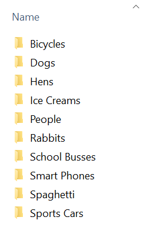
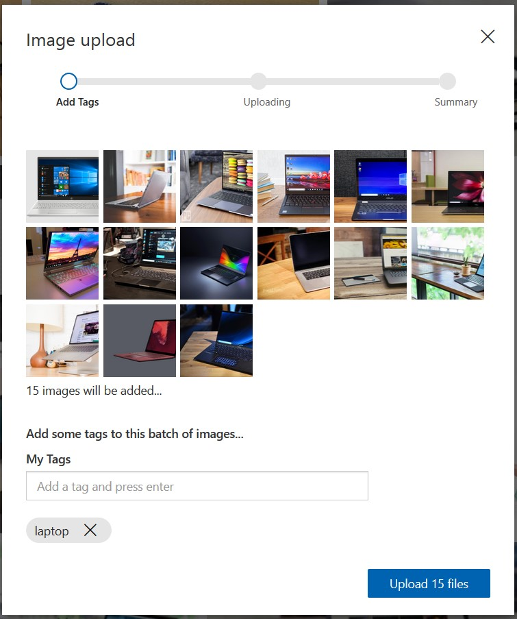
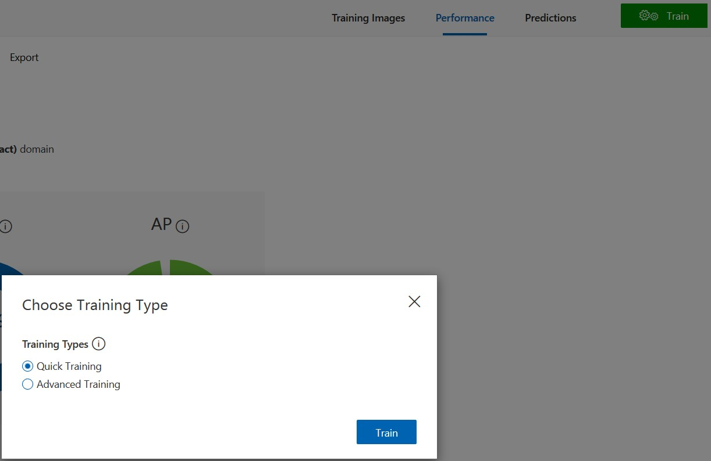

# Lab 5 – Building a Computer Vision solution and deploying to the edge


For this lab, we will use the Azure Custom Vision service to train a Machine Learning (ML) model for image classification. We will use that model to create a .NET Core application to take images from a folder on your lab PC. It will then use Windows ML to classify the image, then send the result to Azure IoT Hub. We will deploy that application to a Azure IoT Edge container and deploy back to your Lab PC using Azure IoT Edge. Finally, we will visualize the results using Time Series Insights.

## Ready to go

When starting the lab, you should have these things open on your development machine:

1. These instructions.

1. [Custom Vision Portal](https://www.customvision.ai/) open in a browser tab, logged in.  

1. [Time Series Insights explorer](https://insights.timeseries.azure.com/) in another browser tab, also logged in.

## 1 - Custom Vision

### 1.1 - Training images

1. On your development Lab PC in `C:\Labs\src\IoTLabs.Lab5Images` are  different objects with 5+ photos of each. The photos are organized in a folder named for each type of object - this will make them easier to upload.
  


    
### 1.2 - Create a Custom Vision Image Classification project

1. Log into the [Custom Vision Portal](https://www.customvision.ai/).

1. Create a New Project. 

1. Configure your project as follows:

    | Field | Value |
    | --- | --- |
    | Name | Enter a unique name |
    | Description | Leave blank |
    | Resource | Select the existing item in the list  |
    | Project Types | Classification |
    | Classification Types | Multiclass (Single tag per image) |
    | Domains | General **(compact)** |
    |Export Capabilities|Basic platforms|

    **Note:** If you can't see the Export Capabilities, make sure that the Domain is set to General (compact).
   
    
1. Verify that all the details you have entered are correct.
   

1. Click **Create project**.

### 1.3 - Upload and tag training data

1. Click the Add image button and bulk upload your images based on the object type.
    * Upload five+, but not all of the first object picture and add the object tag. Then upload five+ of the second object and add the object2 tag, etc. Hold down the ctrl key to select multiple photos of the same object and it will label them with all the same tag.
    * Each time you upload the images for a given object, specify the tag at that time.

    **Note:** You will use the pictures you did not upload to the Custom Vision model to test the model later. 

1. Example of bulk uploading and tagging images.
   
    
### 1.4 - Train your model

1. Click on the **Training** button (green one in the top right).

1. Select the **Quick Training** option.

1. Click **Train**.

4. Example of training your model:
   

### 1.5 - Test your model

1. Select **Quick Test** to test the model.

1. Using the camera app on your PC, take one more picture of one of the objects

1. Upload the picture you took, verify that it was predicted correctly.

### 1.6 - Export your model

1. Switch to the Performance tab in the portal.

1. Click on **Export**.

1. Select **ONNX** for the type.

1. Select **ONNX1.2** for the version, if you are given the option to do so.

1. Click Export.
   

1. After Custom Vision has prepared the Export, click **Download**.

1. Find the zipped folder, right-click and **Extract all**. 

**Hint:** Browse to your Downloads folder.

1. Rename **model.onnx** to **CustomVision.onnx**.
 


## 2 - Package the model into a C# .NET Application

### 2.1 - Get your model file

1. Copy the CustomVision.onnx model file from your downloads directory into the lab directory **C:\Labs\Content\src\IoTLabs.CustomVision**, overwrite the existing onnx file.

### 2.2 Add Images 

1. Navigate to **C:\images** (create this folder if it doesn't exist) and add some new images that you would like the model to evaluate.
**Note:** The images must be .jpg and **must not** be in a sub folder (C:/images/sub/image.jpg).


### 2.3 - Build & Test the sample

1. Open a Command Prompt window and enter the following 4 lines of commands, **one after the other**. These commands build and package the application into a release folder then runs the application using our machine learning model and the images in the `C:/images` folder as the test data:

```
cd C:\Labs\Content\src\IoTLabs.CustomVision
dotnet publish -c Release -o ./release -r win-x64 --self-contained true
./release/WindowsAiEdgeLabCV.exe -i --model=CustomVision.onnx
```

**Example output:**
```
4/24/2019 4:09:04 PM: Loading modelfile 'CustomVision.onnx' on the CPU...
4/24/2019 4:09:04 PM: ...OK 594 ticks
4/24/2019 4:09:05 PM: Running the model...
4/24/2019 4:09:05 PM: ...OK 47 ticks
4/24/2019 4:09:05 PM: Inferenced: {"results":[{"label":"Mug","confidence":1.0}],"metrics":{"evaltimeinms":47,"cycletimeinms":0},"imgSrc":"c:\images\mug.jpg"}
```

## 3 - Build and push a container

### 3.0 - Prepare your docker lab environment

1.  Open a PowerShell window **as an Administrator** (right click on the PowerShell entry and select Run as Administrator) and run the following commands to use a cached version of the base container to reduce internet bandwidth use.

```powershell
docker load -i C:\Labs\Docker\windows1809.tar
```

### 3.1 - Containerize the sample app

The following steps assume that you have created a Azure Container Registry in Lab 3.

1.  Open PowerShell **as Administrator** (right click on the PowerShell entry and select Run as Administrator) and run the following commands:

3. Update the **$registryName** variable below by substituting the **[azure-container-registry-name]** with its value in the **notes** file on your desktop, then run the commands.

**Note:** each time you rebuild the container, you should increment the **$version** variable.

```powershell
cd C:\Labs\Content\src\IoTLabs.CustomVision\release

#SAMPLE: msiotlabsiiauser01acr (this is the container registry created in lab 03)
$registryName = "[azure-container-registry-name]"
$version = "1.0"
$imageName = "customvision"

$containerTag = "$registryName.azurecr.io/$($imageName):$version-x64-win1809"
docker build . -t $containerTag
```

4.  Type **$containerTag** and press **Enter** to get the full container string. Save a copy of this value with the **notes** file on your desktop as you will need it in step 5.3.

## 4 - Push Docker image to Azure Container Registry (ACR)

### 4.1 - Push container to ACR

1. Run the following powershell commands to login to the Azure CLI and set your Azure subscription scope to our lab subscription:
```
az login
az account set --subscription 'MSIoTLabs-IIA'
```

2. Run the following commands to login to the Azure Container Registry and upload the container into Azure:

```powershell
az acr login --name $registryName
docker push $containerTag
```

## 5 - Deploy IoT Edge Modules


### 5.1 - Find Azure Container Registry Values 
In this step we will be gathering the keys/values required for the next step. You can find most of this information in the access keys section of your container registry in Azure:

1. Login to the [Azure Portal](https://portal.azure.com)

2. Click on **Resource groups** and select your resource group (E.g. msiotlabs-iia-user01).

3. Select your **Container registry** (E.g. msiotlabsiiauser01acr)

4. Click **Access Keys**

5. Keep this page ready for the next step

### 5.2 - Author a deployment.json file

Now that we have a container image with our inferencing logic stored in our container registry, it's time to create an Azure IoT Edge deployment to our device.

1. Go to **C:\Labs\Content\src\IoTLabs.IoTEdge**

2. Edit the **deployment.template.lab05.win-x64.json** file.

3. In the JSON find the following variables and replace them with the correct values:

   | Variables | Value | Example |
   | --- | --- | --- |
   | ACR_NAME | Registry name | *E.g. msiotlabsiiauser01acr* |
   | ACR_USER | Username | *E.g. msiotlabsiiauser01acr* |
   | ACR_PASSWORD | Password | *E.g. gEkhrpi7ODwuZnpyoCY1WTPyOGX/+JEB* |
   | ACR_ADDRESS | Login server | *E.g. msiotlabsiiauser01acr.azurecr.io* |
   | ACR_IMAGE | Value of $containerTag | *E.g. msiotlabsiiauser01acr.azurecr.io/customvision:1.0-x64-win1809* |

**Hint:** Refer to the page from the previous step, for details such as usernames and passwords.

**Hint:** You can type **$containerTag** in PowerShell or found its value in the **notes** file on your desktop to get the full container string required to replace ACR_IMAGE.

**Hint:** The ACR_IMAGE variable is in the customvision module definition.

### 5.3 - Deploy the IoT Edge deployment.json file. 

Using the IoT Edge device that we created in Lab03, we will overwrite the modules with a new 'custom vision' module.

1. Replace **[Edge Device Id]** and **[IoT Hub Name]** with their respective values from the **notes** file on your desktop, then run the following command in PowerShell:

```
#SAMPLE: az iot edge set-modules --device-id IOTEDGE01 --hub-name msiotlabs-iia-user01-iothub --content "C:\Labs\Content\src\IoTLabs.IoTEdge\deployment.template.lab05.win-x64.json"
az iot edge set-modules --device-id [Edge Device Id] --hub-name [IoT Hub Name] --content "C:\Labs\Content\src\IoTLabs.IoTEdge\deployment.template.lab05.win-x64.json"
```

**Hint:** Device ID can be retrieved from the Azure Portal by navigating to your Resource group, then into the IoT Hub, and selecting the IoT Edge option under the Automatic Device Manager header on the left.

2. To get information about the modules deployed to your IoT Hub, swap out **[Edge Device Id]** and **[IoT Hub Name]** then run the following command:
```
#SAMPLE: az iot hub module-identity list  --device-id IOTEDGE01 --hub-name msiotlabs-iia-user01-iothub
az iot hub module-identity list --device-id [Edge Device Id] --hub-name [IoT Hub Name]
```

### 5.4 - Verify the deploy has started in Azure

1. Navigate to your IoT Edge Device in your IoT Hub.

1. Go to the device details page.

1. Under the Modules tab click on the customvision module.
   

1. Under the IoT Edge Module Settings tab.

1. Verify that the Desired Value for the Image URI matches the one that you entered in your deployment template.

1. An example of IoT Edge Module Settings.
   

**Hint:** The Desired Value column matches what is specified in the deploment template, the Reported Value column matches what the devices believes it is running.


### 5.5 - Verify the deployment on device

Wait a few minutes for the deployment to go through. On the target device you can inspect the running modules. Run the command below in PowerShell:

```
iotedge list
```

Success looks like this:

```
NAME             STATUS           DESCRIPTION      CONFIG
customvision     running          Up 32 seconds    aiedgelabcr.azurecr.io/customvision:1.0-x64-win1809
edgeAgent        running          Up 2 minutes     mcr.microsoft.com/azureiotedge-agent:1.0
edgeHub          running          Up 1 second      mcr.microsoft.com/azureiotedge-hub:1.0
```

Once the modules have started, the following command shows logs:

```
iotedge logs customvision
```

### 5.6 - Troubleshooting modules

#### 1. Check that IoT Edge is configured correctly

Run the following command, using PowerShell in Administrator mode:

```
iotedge check
```

#### 2. Get the logs for an IoT Edge module

```
iotedge logs <module-name>
```

#### 3. Restart an IoT Edge module

If a module is not running you can try restarting it through the `iotedge` runtime, using PowerShell in Administrator mode:

```
iotedge restart <module-name>
```

#### 4. Get the logs for the IoT Edge runtime

If the module logs are empty or unhelpful, can you pull all of the IoT Edge logs, using PowerShell in Administrator mode:

```
. {Invoke-WebRequest -useb aka.ms/iotedge-win} | Invoke-Expression; Get-IoTEdgeLog
```

#### 5. Restart the IoT Edge runtime

This will restart all of the modules on the IoT Edge device, using PowerShell in Administrator mode:

```
Restart-Service iotedge
```

Make sure to check that the `iotedge` runtime has started successfully:

```
Get-Service iotedge
```
