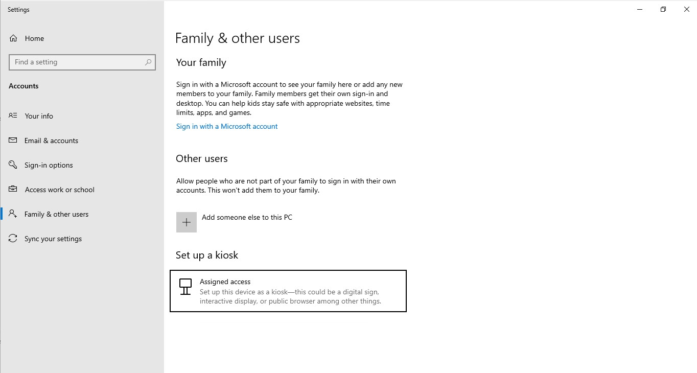
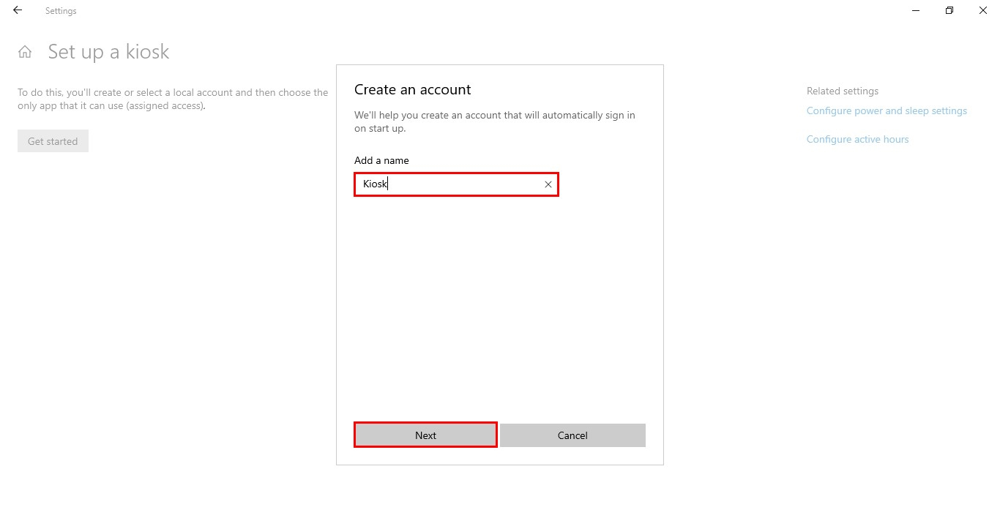
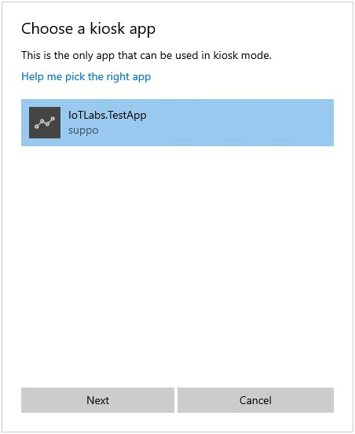
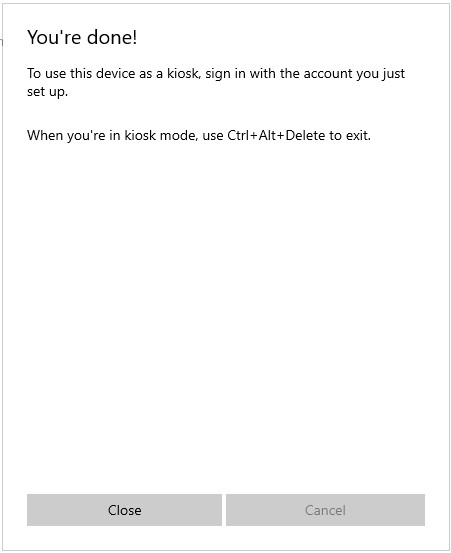

# Lab 06 - Turn your device into a locked down kiosk

## Deploy an app to use in Kiosk Mode
As we are deploying an app that has not been officially released on the Windows store, we need to turn on developer features. Once enbabled, the IoTLabs UWP app can be installed.

### Turn on developer features
1. Open the start menu and type **Developer Settings** and select the top option\

2. Select the **Developer Mode** toggle\

3. Click **Yes** and wait a few minutes for it to load the required packages\

### Install the application
1. Navigate to `C:\Labs\content\src\IoTLabs.AssignedAccess\IoTLabs.TestApp_1.0.1.0_Debug_Test`
2. Right click on the file named **Install.ps1** and click **Run with PowerShell**\

3. When prompted, type **Y** and allow the app to finish installing.

## Option 1 - Using Settings to set up Assigned Access

You can use **Settings** on the local device to quickly configure one or a few devices as a kiosk. 

### Configure Assigned Access
1.  Go to **Start** > **Settings** > **Accounts** > **Other users**\

2.  Select **Set up a kiosk > Assigned access**, and then select **Get started**
3.  When prompted set the Kiosk users name to **Kiosk**\

4.  When prompted to select an Application, select **IoTLabs.TestApp**\

5.  Select **Close**\

6.  Restart the device

### Remove Assigned Access
1. Push **Ctrl + Alt + Delete**
2. Switch user into your administrative account
3. Go to **Start** > **Settings** > **Accounts** > **Other users**
4. Select **Set up a kiosk**
3. Select the **Kiosk** users tile and then select **Remove kiosk**

## Option 2 - Using a Provisioning Package to set up Assigned Access

You can use **Provisioning Packages** to quickly and consistently deploy settings to a fleet of devices. This can be done either during OOBE or after the device has been set up.

### Install

1. Go to `C:\Labs\Content\src\IoTLabs.AssignedAccess\`
2. Open the ppkg file `lab06.ppkg`, this is the provisioning package that holds all the settings and files required to deploy
3. When prompted click **Yes, add it**\

4. Restart your computer
5. Your device should auto login as the locked down Kiosk user

### Removing the provisioning package 

1. Push **Ctrl + Alt + Delete**
2. Switch user into your administrative account
3. Go to **Start** > **Settings** > **Accounts** > **Access work or school** > **Add or remove a provisioning package**\

4. Select the provisioning package and then select **Remove**\

