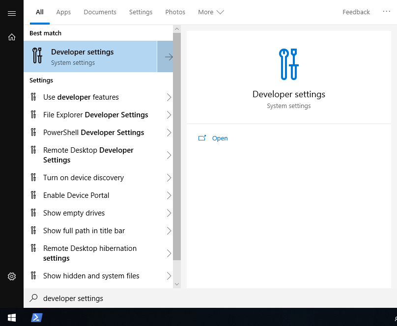
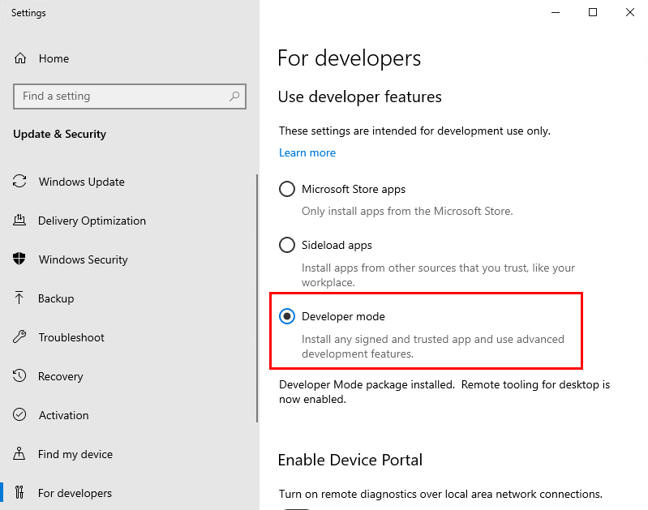
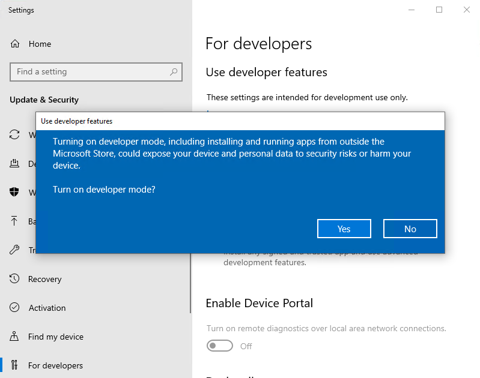
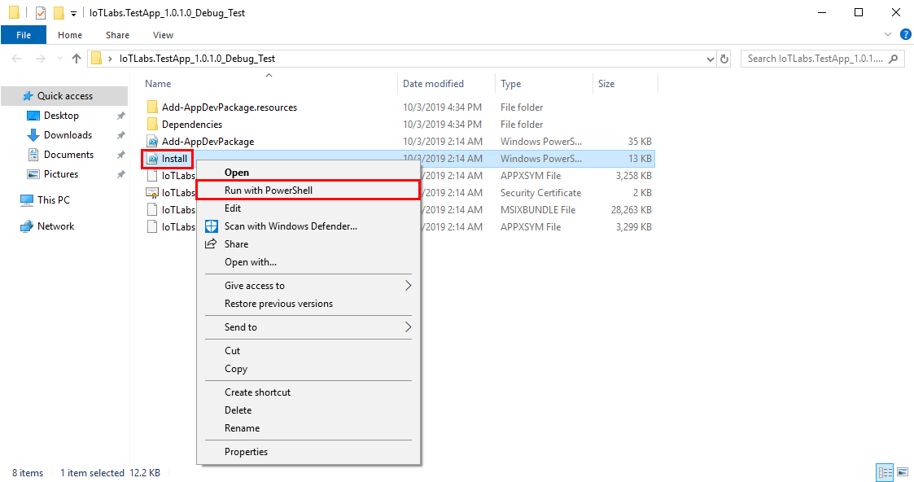
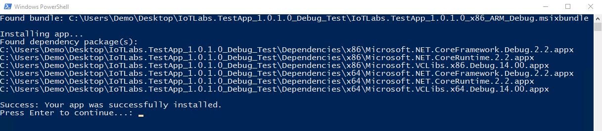
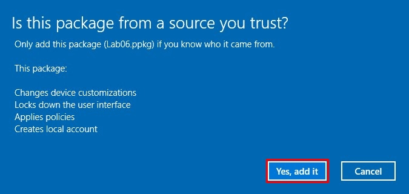
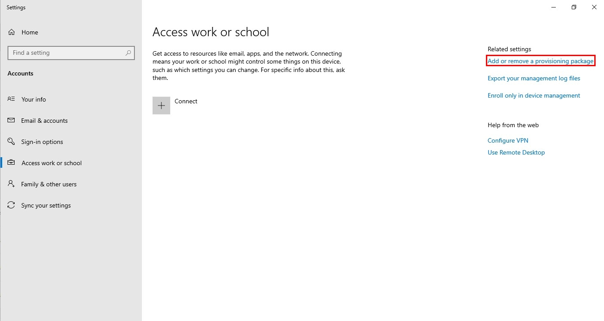
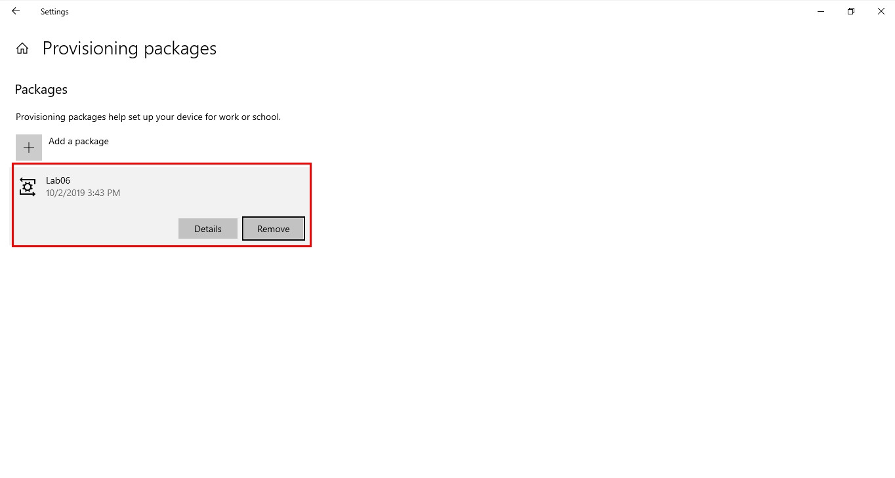

# Lab 06 - Turn your device into a locked down kiosk

## 1 - Deploy an app to use in Kiosk Mode
As we are deploying an app that has not been officially released on the Windows store, we need to turn on developer features. Once enabled, the IoTLabs UWP (Universal Windows Platform) app can be installed.

### 1.1 - Turn on developer features

1. Open the start menu and type **Developer Settings** and select the top option\

2. Select the **Developer Mode** toggle\

3. Click **Yes** and wait a few minutes for it to load the required packages\

### 1.2 - Install the application

1. Navigate to `C:\Labs\content\src\IoTLabs.AssignedAccess\`

2. Unzip **IoTLabs.TestApp_1.0.1.0_Debug_Test** and open the unzipped folder. 
**Hint:** Right-click on the .zip folder and ‘Extract All…’

3. Right click on the file named **Install.ps1** and click **Run with PowerShell**\

4. Look for the message ‘Success: Your app was successfully installed.’ When prompted, type **Y** and **Enter** to allow the app to finish installing.  This closes the PowerShell window.

## 2. Using a Provisioning Package to set up Assigned Access

You can use **Provisioning Packages** to quickly and consistently deploy settings to a fleet of devices. This can be done either during OOBE (Out-Of-Box Experience) or after the device has been set up.

### 2.1 - Install

1. Go to `C:\Labs\Content\src\IoTLabs.AssignedAccess\`
**Hint:** if you have not restarted your device from the previous step, you may need to use the magnifying glass beside the windows icon to search for ‘File Explorer’ to then find your C: drive.

2. Open the ppkg file `lab06.ppkg`, this is the provisioning package that holds all the settings and files required to deploy.

3. Allow the app to make changes to your device, click **Yes**. When prompted click **Yes, add it**\

4. It may look as if nothing has occurred, simply restart your computer.

5. Your device should auto login as the locked down Kiosk user. You should see your application start in full screen without the ability to close it or access any other windows features. 

### 2.2 - Removing the provisioning package 

1. Push **Ctrl + Alt + Delete**

2. Switch user into your administrative account, this is likely to be 'LabUser'. Enter your password that you used previously for your user **lab.userXX@msiotlabs.com**

3. Go to **Start** > **Settings** > **Accounts** > **Access work or school** > **Add or remove a provisioning package**\

4. Select the provisioning package and then select **Remove**  Allow the app to make changes to your device, click **Yes**.  You should notice the Package 'Lab06' has been removed.

