# Lab 06 - Turn your device into a locked down kiosk

## Common Setup Steps

### Install the certificate

1. Navigate to `C:\Labs\content\src\IoTLabs.TestApp\IoTLabs.TestApp`
2. Open the file named **IoTLabs.pfx**
3. Select **Local Machine**, then click **Next**\
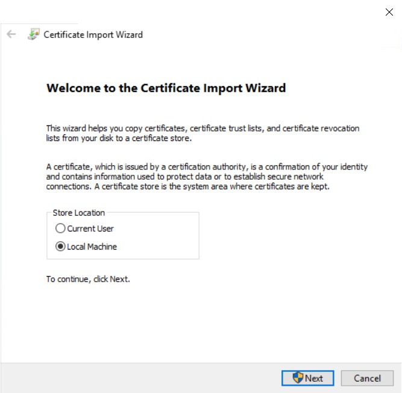
4. When prompted by UAC, select **Yes**\
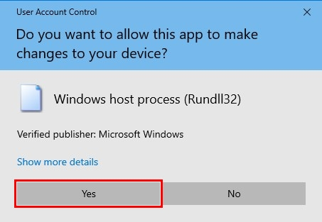
5. Leave the settings as default and click **Next**\
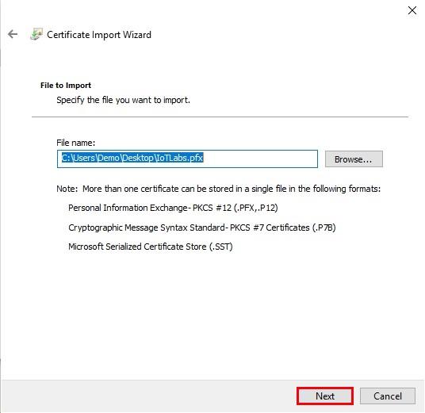
6. Leave the settings as default and click **Next**\
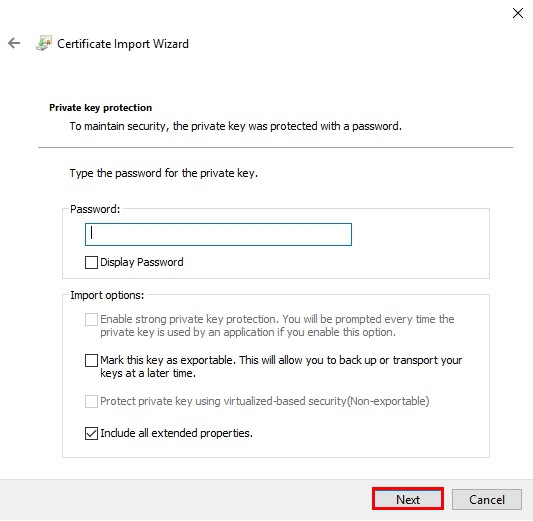
7. Select **Place all certificates in the following store**, then click **Browse...**\
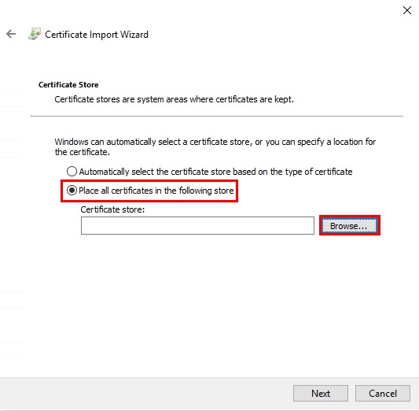
8. Select **Trusted Root Certification Authorities** and click **Ok**\
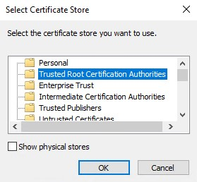\
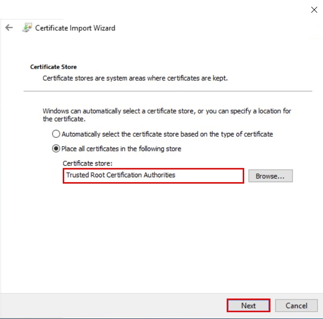
9. Click **Next**, then click **Finish**\
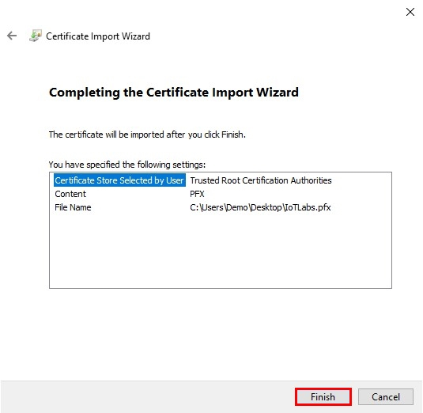

### Build the UWP Application that we will be using for assigned access

1.	Open up the lab project found in `C:\Labs\content\src\IoTLabs.TestApp\IoTLabs.TestApp.sln`
2.	Right click on the project **IoTLabs.TestApp (Universal Windows)** and click **Publish**, then **Create App Packages...**\
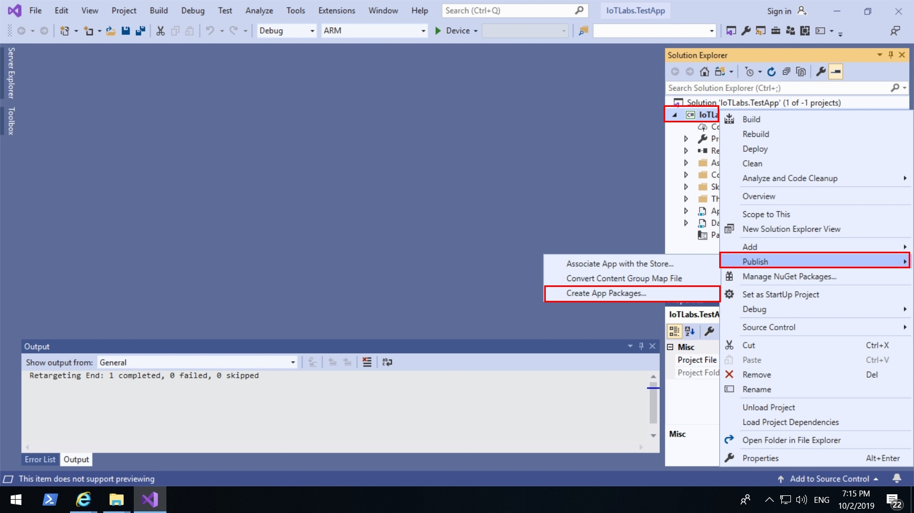
3.	Select **Sideloading**, then click **Next**\
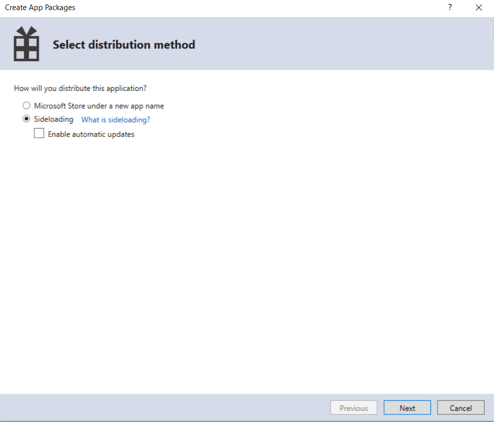
4.	Click **Remove**, then **Select From File** \
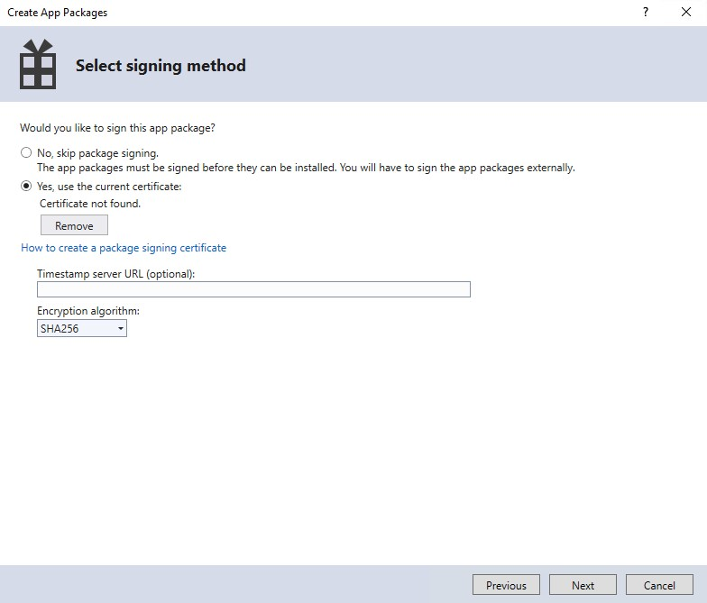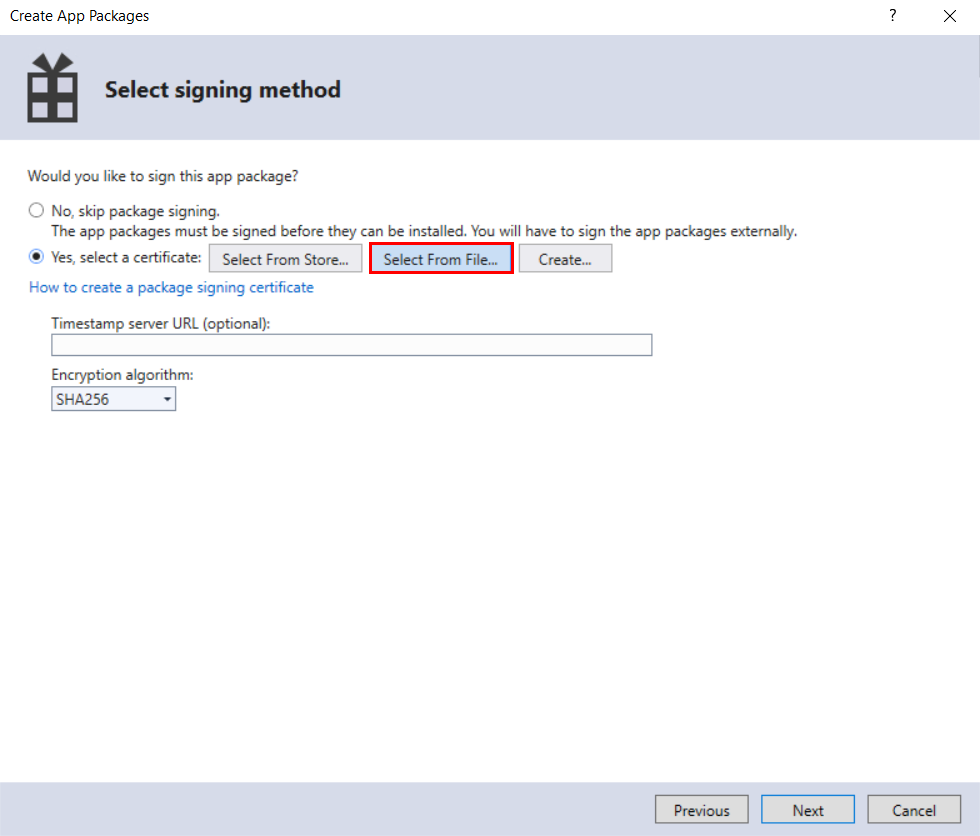
5.  Select **IoTLabs.pfx**\
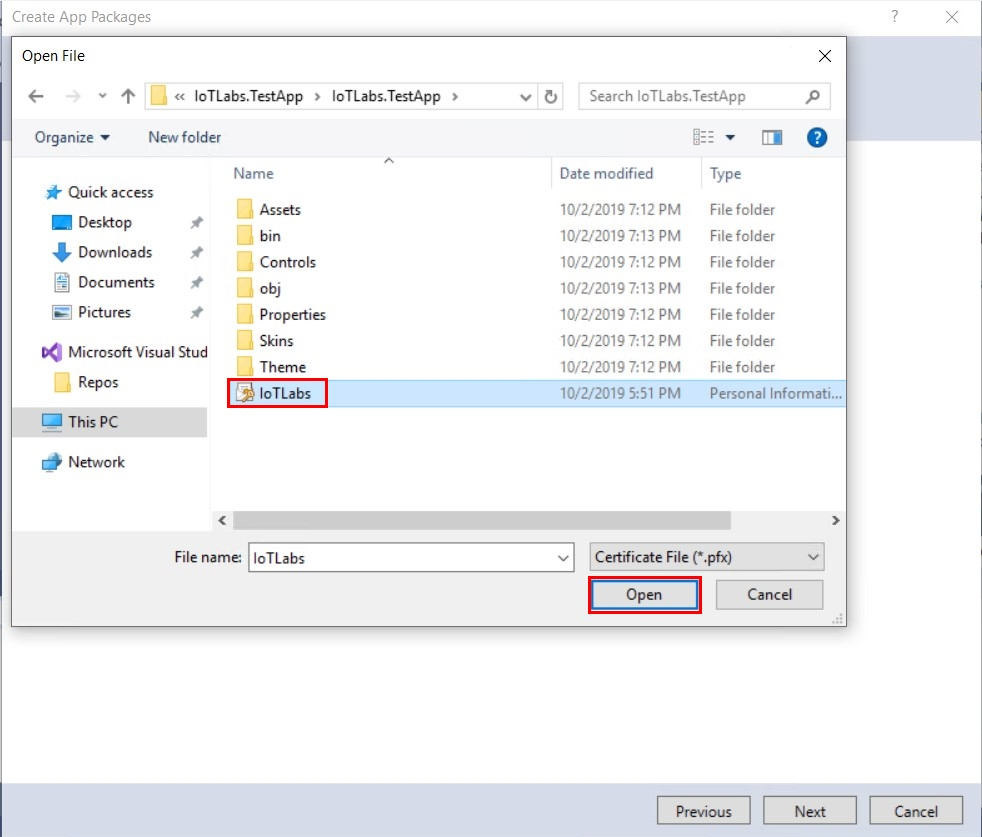
6.  Then click **Next**\
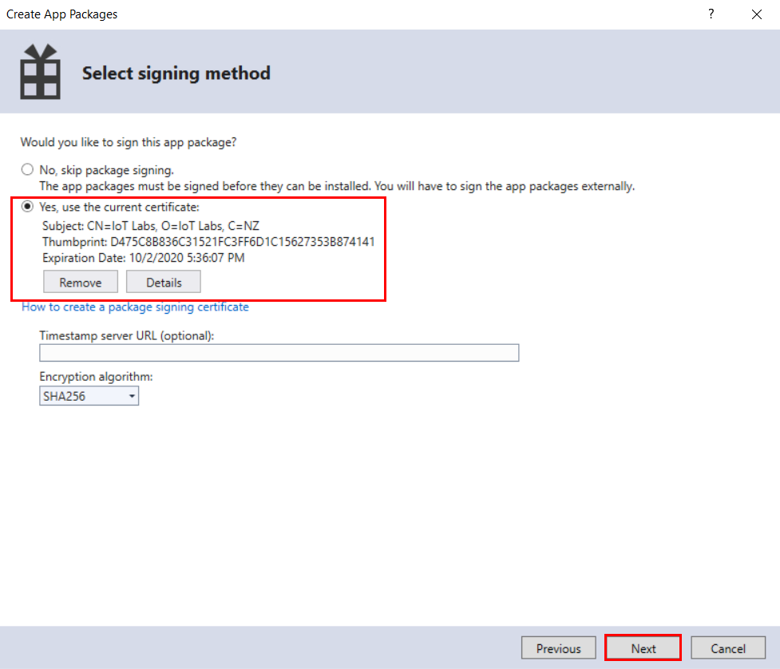
7.	Make sure only the **x86** and **ARM** Architectures are selected then click **Create**\
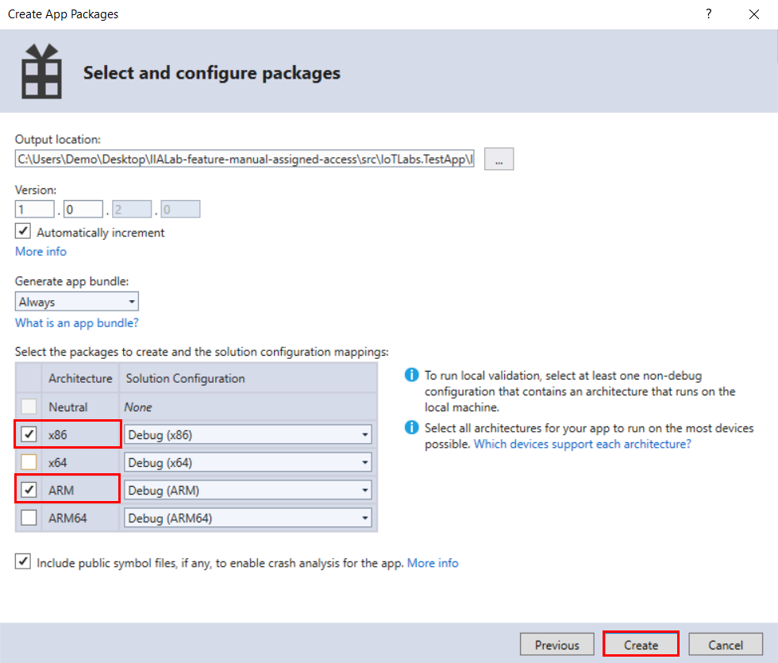
8.	Wait for the publish to finish, then click on the **Output location** link\
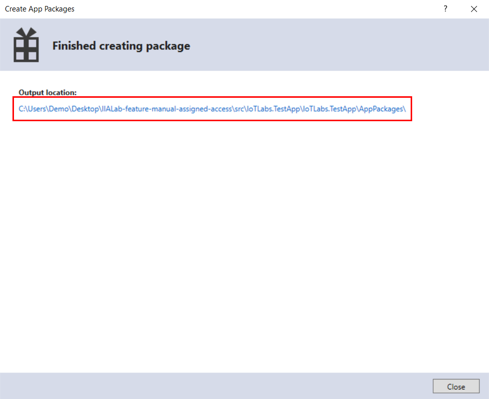
9.	Open **IoTLabs.TestApp_1.0.2.0_Debug_Test** folder, right click on **install.ps1** and click **Run with PowerShell**\
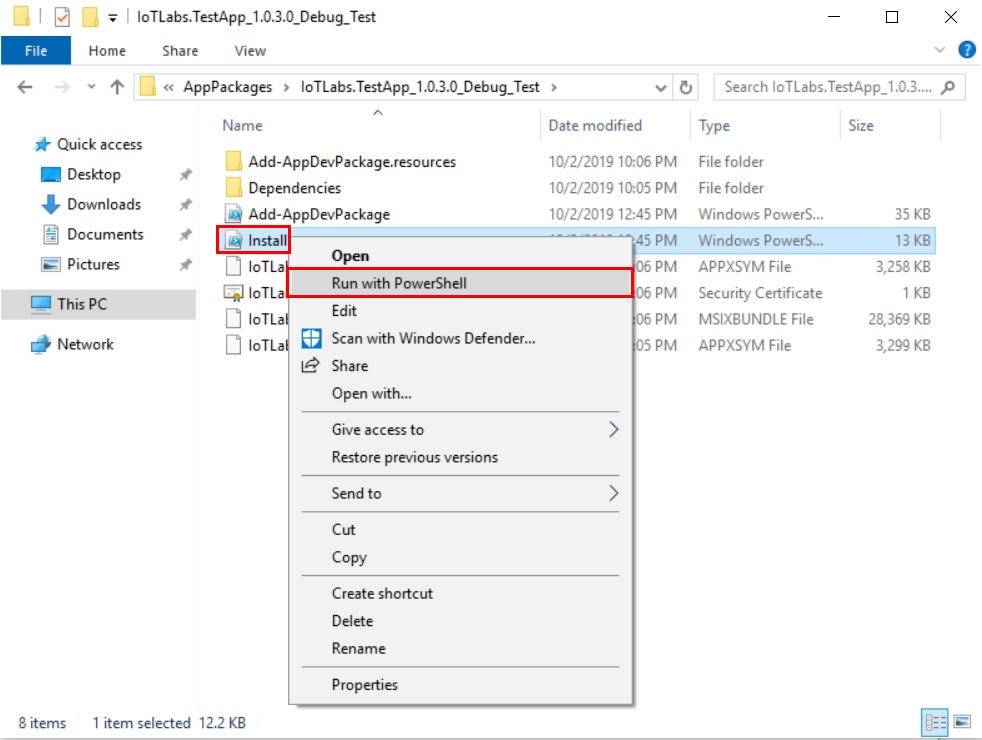

## Option 1 - Using Settings to set up Assigned Access

You can use **Settings** on the local device to quickly configure one or a few devices as a kiosk. 

### Configure Assigned Access
1.  Go to **Start** > **Settings** > **Accounts** > **Other users**\

2.  Select **Set up a kiosk > Assigned access**, and then select **Get started**
3.  When prompted set the Kiosk users name to **Kiosk**\

4.  When prompted to select an Application, select **IoTLabs.TestApp**\

5.  Select **Close**\

6.  Restart the device

### Remove Assigned Access
1. Push **Ctrl + Alt + Delete**
2. Switch user into your administrative account
3. Go to **Start** > **Settings** > **Accounts** > **Other users**
4. Select **Set up a kiosk**
3. Select the **Kiosk** users tile and then select **Remove kiosk**

## Option 2 - Using a Provisioning Package to set up Assigned Access

You can use **Provisioning Packages** to quickly and consistently deploy settings to a fleet of devices. This can be done either during OOBE or after the device has been set up.

### Install

1. Go to `C:\Labs\Content\src\IoTLabs.AssignedAccess\`
2. Open the ppkg file `lab06.ppkg`, this is the provisioning package that holds all the settings and files required to deploy
3. When prompted click **Yes, add it**\

4. Restart your computer
5. Your device should auto login as the locked down Kiosk user

### Removing the provisioning package 

1. Push **Ctrl + Alt + Delete**
2. Switch user into your administrative account
3. Go to **Start** > **Settings** > **Accounts** > **Access work or school** > **Add or remove a provisioning package**\

4. Select the provisioning package and then select **Remove**\

